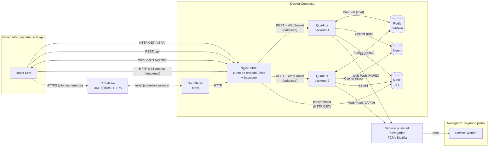
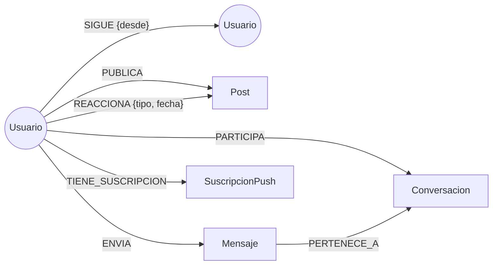

# Red Social Distribuida

Proyecto de la asignatura **Sistemas Distribuidos y Cloud Computing**.

Aplicación web distribuida que implementa las funcionalidades esenciales de una red social, integrando comunicación REST, WebSocket y Web Push, persistencia en una base de datos de grafos y almacenamiento de objetos compatible con S3.

## Integrantes

- Jose
- Luis
- Dayron

## Stack

| Componente | Tecnología |
|---|---|
| Frontend | React |
| Backend | Quarkus + Java |
| Base de datos de grafos | Neo4j |
| Almacenamiento de archivos | Object Storage compatible con S3 |
| Tiempo real | WebSocket |
| Notificaciones | Web Push |
| Despliegue | Docker Compose |

## Arquitectura

El navegador habla con un único punto de entrada (Nginx). Nginx sirve la SPA, reparte las peticiones entre dos instancias del backend y expone las imágenes de MinIO.
Las instancias persisten en Neo4j, guardan archivos en MinIO, se coordinan por Redis para el chat y envían notificaciones a través del servicio push del navegador.



- React SPA y Service Worker corren en el mismo navegador. Se dibujan separados porque el Service Worker sigue activo en segundo plano y recibe las notificaciones aunque la pestaña de la app esté cerrada.
- Las líneas punteadas muestran el camino de los clientes remotos: llevan el mismo tráfico (SPA, REST, WebSocket, imágenes) que un cliente local, pero entran por el túnel HTTPS.

### Qué viaja por cada canal

| Origen → Destino | Mecanismo | Qué transporta | Por qué este mecanismo |
|---|---|---|---|
| React → Quarkus (vía Nginx) | REST/HTTP | CRUD, feed, seguir, reacciones, historial del chat | Operaciones puntuales de pedido/respuesta, sin estado de conexión |
| React ↔ Quarkus (vía Nginx) | WebSocket | Mensajes de chat en tiempo real | Conexión persistente y bidireccional: el servidor envía sin que el cliente pregunte |
| Quarkus → Servicio push → Service Worker | Web Push | Aviso de nueva publicación | Llega aunque la app esté cerrada; el canal lo mantiene el navegador, no la aplicación |
| Quarkus → Neo4j | Bolt + Cypher | Usuarios, relaciones, posts, mensajes, suscripciones push | Los datos son relaciones: seguir, publicar, reaccionar |
| Quarkus → MinIO | S3 API | Archivos binarios (imágenes) | Los binarios no pertenecen a una base de datos |
| Navegador → MinIO (vía Nginx) | HTTP GET | Descarga de imágenes | El backend no tiene que retransmitir cada imagen |
| Quarkus ↔ Redis | Pub/Sub | Mensajes de chat entre instancias | Cada instancia solo conoce sus propias conexiones WebSocket; el broker las comunica |
| Cliente remoto → Cloudflare → `cloudflared` → Nginx | Túnel HTTPS | Todo el tráfico de la aplicación | Da un contexto seguro (HTTPS), requisito de Service Worker y Web Push, sin abrir puertos |

## Modelo del grafo



### Nodos

| Nodo | Propiedades |
|---|---|
| `Usuario` | `id` (UUID), `username`, `email`, `passwordHash`, `nombre`, `bio`, `avatarKey?`, `creadoEn` |
| `Post` | `id`, `texto`, `fecha`, `mediaKey?`, `mediaTipo?` |
| `Conversacion` | `id`, `creadaEn` |
| `Mensaje` | `id`, `texto`, `fecha` |
| `SuscripcionPush` | `endpoint`, `p256dh`, `auth`, `creadaEn` |

Las propiedades con `?` son opcionales.

### Relaciones

| Relación | Propiedades | Significado |
|---|---|---|
| `(:Usuario)-[:SIGUE]->(:Usuario)` | `desde` | Relación social principal |
| `(:Usuario)-[:PUBLICA]->(:Post)` | — | Autoría |
| `(:Usuario)-[:REACCIONA]->(:Post)` | `tipo`, `fecha` | Reacción (mínimo `LIKE`) |
| `(:Usuario)-[:PARTICIPA]->(:Conversacion)` | — | Integrantes de un chat |
| `(:Usuario)-[:ENVIA]->(:Mensaje)` | — | Autor del mensaje |
| `(:Mensaje)-[:PERTENECE_A]->(:Conversacion)` | — | Historial |
| `(:Usuario)-[:TIENE_SUSCRIPCION]->(:SuscripcionPush)` | — | Dispositivos que reciben Web Push |

### Constraints de unicidad

Se crean al iniciar el backend. Son idempotentes (`IF NOT EXISTS`), porque las dos instancias los ejecutan.

```cypher
CREATE CONSTRAINT usuario_id IF NOT EXISTS FOR (u:Usuario) REQUIRE u.id IS UNIQUE;
CREATE CONSTRAINT usuario_username IF NOT EXISTS FOR (u:Usuario) REQUIRE u.username IS UNIQUE;
CREATE CONSTRAINT usuario_email IF NOT EXISTS FOR (u:Usuario) REQUIRE u.email IS UNIQUE;
CREATE CONSTRAINT post_id IF NOT EXISTS FOR (p:Post) REQUIRE p.id IS UNIQUE;
CREATE CONSTRAINT conversacion_id IF NOT EXISTS FOR (c:Conversacion) REQUIRE c.id IS UNIQUE;
CREATE CONSTRAINT mensaje_id IF NOT EXISTS FOR (m:Mensaje) REQUIRE m.id IS UNIQUE;
CREATE CONSTRAINT suscripcion_endpoint IF NOT EXISTS FOR (s:SuscripcionPush) REQUIRE s.endpoint IS UNIQUE;
```

### Decisiones del modelo

| Decisión | Motivo |
|---|---|
| IDs UUID propios en la propiedad `id`, no el `elementId` interno de Neo4j | El identificador interno lo asigna la base y puede reutilizarse tras borrar nodos; un UUID propio es estable, sirve en las URLs de la API y está protegido por un constraint de unicidad |
| Una reacción por usuario y post, creada con `MERGE` | Reaccionar dos veces no duplica la relación; un reintento del cliente produce el mismo resultado |
| Chat uno a uno | Una conversación se inicia con un único `usuarioId` (`POST /api/conversaciones`) y la operación es idempotente: dos usuarios comparten una sola conversación |
| `Post.mediaKey` es la única referencia al archivo en MinIO | Guarda la clave del objeto (por ejemplo `posts/<postId>/<uuid>.jpg`), nunca el binario ni una URL absoluta |

### Criterio de recomendación

**Amigos de amigos, ordenados por cantidad de conexiones en común.**

1. Se toman los usuarios que siguen las personas que yo sigo (2 niveles).
2. Se excluye a uno mismo y a quienes ya sigo.
3. Se ordena por cuántas de mis conexiones siguen al candidato: más conexiones en común, más relevante.
4. En caso de empate, se prioriza al que tiene más seguidores.
5. **Arranque en frío:** si no sigo a nadie, se recomiendan los usuarios con más seguidores. Sigue saliendo del grafo, porque es el grado de entrada del nodo.
6. **Recomendación explicable:** la consulta devuelve hasta tres conexiones en común para mostrar *"Seguido por Luis, Dayron y 2 más"*. El usuario entiende el motivo y el recorrido del grafo queda visible en la interfaz.

### Consultas Cypher

Reglas que cumplen todas las consultas:

| Regla | Motivo |
|---|---|
| Devolver campos proyectados, nunca el nodo completo | El nodo `Usuario` contiene `passwordHash` |
| Usar siempre parámetros (`$userId`), nunca concatenar texto | Evita Cypher injection y permite reutilizar el plan de ejecución |
| Límite fijo de saltos en caminos de largo variable (3 en alcance, 6 en separación) | Cypher no admite parametrizarlo y los caminos crecen exponencialmente |
| Grados de separación sin dirección | Mide la cercanía entre usuarios sin importar quién sigue a quién |
| Cada consulta respalda un endpoint o flujo real | El enunciado no admite componentes decorativos |

Cobertura de los problemas que pide el enunciado:

| Problema solicitado | Consulta |
|---|---|
| Publicaciones de la red | C1 y C7 |
| Usuarios recomendados | C2 |
| Usuarios en común | C3 |
| Usuarios alcanzables | C4 |
| Extra: grados de separación | C5 |
| Seguidores de un usuario | C6 |

#### C1. Feed (2 niveles: usuario → seguidos → publicaciones)

```cypher
MATCH (yo:Usuario {id: $userId})-[:SIGUE]->(autor:Usuario)-[:PUBLICA]->(p:Post)
WITH yo, p, autor
ORDER BY p.fecha DESC
SKIP $skip LIMIT $limit
RETURN p.id AS id, p.texto AS texto, p.fecha AS fecha, p.mediaKey AS mediaKey,
       autor.id AS autorId, autor.username AS autorUsername,
       COUNT { (p)<-[:REACCIONA]-() } AS reacciones,
       EXISTS { (yo)-[:REACCIONA]->(p) } AS reaccionado
```

#### C2. Recomendaciones (2 niveles)

```cypher
MATCH (yo:Usuario {id: $userId})-[:SIGUE]->(intermedio:Usuario)-[:SIGUE]->(sug:Usuario)
WHERE sug <> yo AND NOT (yo)-[:SIGUE]->(sug)
WITH sug,
     count(DISTINCT intermedio) AS enComun,
     collect(DISTINCT intermedio.username)[..3] AS conexiones
WITH sug, enComun, conexiones, COUNT { (sug)<-[:SIGUE]-() } AS seguidores
ORDER BY enComun DESC, seguidores DESC
LIMIT 10
RETURN sug.id AS id, sug.username AS username, sug.nombre AS nombre,
       enComun, conexiones, seguidores
```

Arranque en frío (el usuario no sigue a nadie):

```cypher
MATCH (yo:Usuario {id: $userId}), (sug:Usuario)
WHERE sug <> yo AND NOT (yo)-[:SIGUE]->(sug)
WITH sug, COUNT { (sug)<-[:SIGUE]-() } AS seguidores
ORDER BY seguidores DESC
LIMIT 10
RETURN sug.id AS id, sug.username AS username, sug.nombre AS nombre, seguidores
```

#### C3. Seguidos en común entre dos usuarios

```cypher
MATCH (a:Usuario {id: $userA})-[:SIGUE]->(comun:Usuario)<-[:SIGUE]-(b:Usuario {id: $userB})
RETURN comun.id AS id, comun.username AS username, comun.nombre AS nombre
ORDER BY username
```

#### C4. Usuarios alcanzables (hasta 3 niveles)

```cypher
MATCH camino = (yo:Usuario {id: $userId})-[:SIGUE*1..3]->(u:Usuario)
WHERE u <> yo
WITH u, min(length(camino)) AS distancia
RETURN u.id AS id, u.username AS username, u.nombre AS nombre, distancia
ORDER BY distancia, username
```

#### C5. Grados de separación entre dos usuarios

```cypher
MATCH (a:Usuario {id: $userA}), (b:Usuario {id: $userB})
MATCH camino = shortestPath((a)-[:SIGUE*..6]-(b))
RETURN [n IN nodes(camino) | n.username] AS cadena, length(camino) AS grados
```

#### C6. Seguidores a notificar cuando alguien publica (usada por Web Push)

```cypher
MATCH (autor:Usuario {id: $autorId})<-[:SIGUE]-(seg:Usuario)-[:TIENE_SUSCRIPCION]->(s:SuscripcionPush)
RETURN seg.id AS usuarioId, s.endpoint AS endpoint, s.p256dh AS p256dh, s.auth AS auth
```

#### C7. Descubrir: publicaciones que reaccionó mi red, de autores que no sigo

```cypher
MATCH (yo:Usuario {id: $userId})-[:SIGUE]->(amigo:Usuario)-[:REACCIONA]->(p:Post)<-[:PUBLICA]-(autor:Usuario)
WHERE autor <> yo AND NOT (yo)-[:SIGUE]->(autor)
WITH p, autor, count(DISTINCT amigo) AS amigosQueReaccionaron
ORDER BY amigosQueReaccionaron DESC, p.fecha DESC
LIMIT 10
RETURN p.id AS id, p.texto AS texto, p.fecha AS fecha, p.mediaKey AS mediaKey,
       autor.id AS autorId, autor.username AS autorUsername, amigosQueReaccionaron
```
