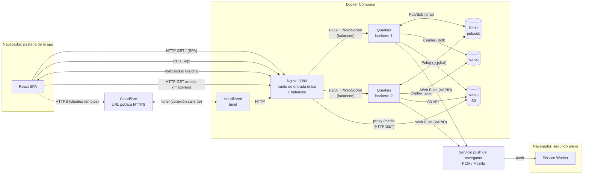
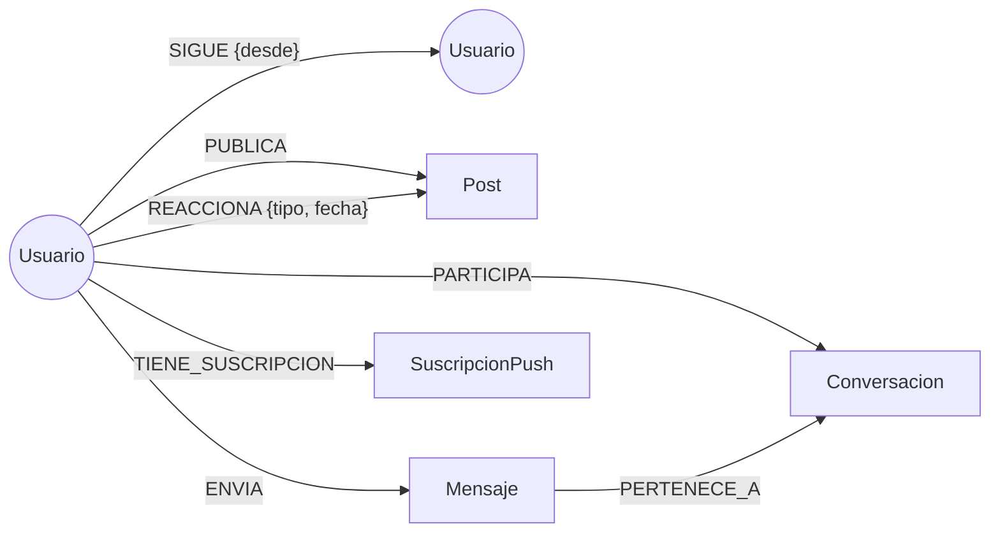
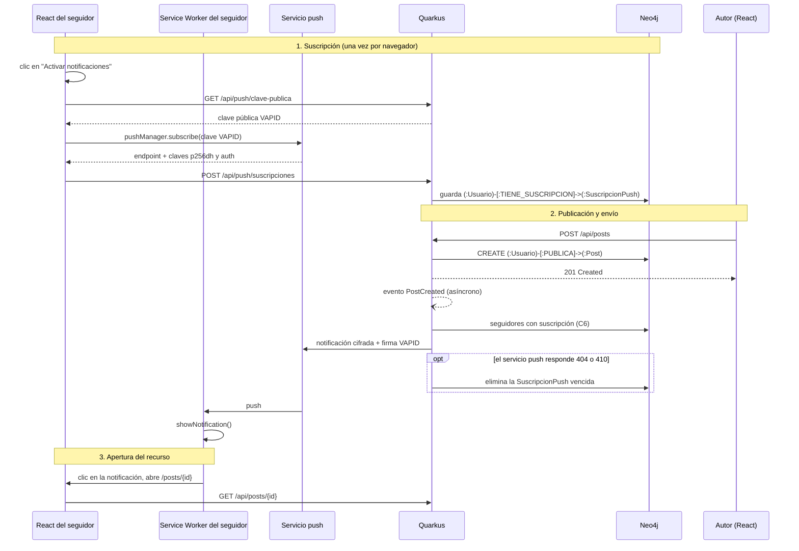

# Red Social Distribuida

Proyecto de la asignatura **Sistemas Distribuidos y Cloud Computing**.

Aplicación web distribuida que implementa las funcionalidades esenciales de una red social, integrando comunicación REST, WebSocket y Web Push, persistencia en una base de datos de grafos y almacenamiento de objetos compatible con S3.

## Integrantes

- Jose
- Luis
- Dayron

## Stack

| Componente | Tecnología |
|---|---|
| Frontend | React |
| Backend | Quarkus + Java |
| Base de datos de grafos | Neo4j |
| Almacenamiento de archivos | Object Storage compatible con S3 |
| Tiempo real | WebSocket |
| Notificaciones | Web Push |
| Despliegue | Docker Compose |

## Arquitectura

El navegador habla con un único punto de entrada (Nginx). Nginx sirve la SPA, reparte las peticiones entre dos instancias del backend y expone las imágenes de MinIO.
Las instancias persisten en Neo4j, guardan archivos en MinIO, se coordinan por Redis para el chat y envían notificaciones a través del servicio push del navegador.



- React SPA y Service Worker corren en el mismo navegador. Se dibujan separados porque el Service Worker sigue activo en segundo plano y recibe las notificaciones aunque la pestaña de la app esté cerrada.
- Las líneas punteadas muestran el camino de los clientes remotos: llevan el mismo tráfico (SPA, REST, WebSocket, imágenes) que un cliente local, pero entran por el túnel HTTPS.

### Qué viaja por cada canal

| Origen → Destino | Mecanismo | Qué transporta | Por qué este mecanismo |
|---|---|---|---|
| React → Quarkus (vía Nginx) | REST/HTTP | CRUD, feed, seguir, reacciones, historial del chat | Operaciones puntuales de pedido/respuesta, sin estado de conexión |
| React ↔ Quarkus (vía Nginx) | WebSocket | Mensajes de chat en tiempo real | Conexión persistente y bidireccional: el servidor envía sin que el cliente pregunte |
| Quarkus → Servicio push → Service Worker | Web Push | Aviso de nueva publicación | Llega aunque la app esté cerrada; el canal lo mantiene el navegador, no la aplicación |
| Quarkus → Neo4j | Bolt + Cypher | Usuarios, relaciones, posts, mensajes, suscripciones push | Los datos son relaciones: seguir, publicar, reaccionar |
| Quarkus → MinIO | S3 API | Archivos binarios (imágenes) | Los binarios no pertenecen a una base de datos |
| Navegador → MinIO (vía Nginx) | HTTP GET | Descarga de imágenes | El backend no tiene que retransmitir cada imagen |
| Quarkus ↔ Redis | Pub/Sub | Mensajes de chat entre instancias | Cada instancia solo conoce sus propias conexiones WebSocket; el broker las comunica |
| Cliente remoto → Cloudflare → `cloudflared` → Nginx | Túnel HTTPS | Todo el tráfico de la aplicación | Da un contexto seguro (HTTPS), requisito de Service Worker y Web Push, sin abrir puertos |

## Modelo del grafo



### Nodos

| Nodo | Propiedades |
|---|---|
| `Usuario` | `id` (UUID), `username`, `email`, `passwordHash`, `nombre`, `bio`, `avatarKey?`, `creadoEn` |
| `Post` | `id`, `texto`, `fecha`, `mediaKey?`, `mediaTipo?` |
| `Conversacion` | `id`, `creadaEn` |
| `Mensaje` | `id`, `texto`, `fecha` |
| `SuscripcionPush` | `endpoint`, `p256dh`, `auth`, `creadaEn` |

Las propiedades con `?` son opcionales.

### Relaciones

| Relación | Propiedades | Significado |
|---|---|---|
| `(:Usuario)-[:SIGUE]->(:Usuario)` | `desde` | Relación social principal |
| `(:Usuario)-[:PUBLICA]->(:Post)` | — | Autoría |
| `(:Usuario)-[:REACCIONA]->(:Post)` | `tipo`, `fecha` | Reacción (mínimo `LIKE`) |
| `(:Usuario)-[:PARTICIPA]->(:Conversacion)` | — | Integrantes de un chat |
| `(:Usuario)-[:ENVIA]->(:Mensaje)` | — | Autor del mensaje |
| `(:Mensaje)-[:PERTENECE_A]->(:Conversacion)` | — | Historial |
| `(:Usuario)-[:TIENE_SUSCRIPCION]->(:SuscripcionPush)` | — | Dispositivos que reciben Web Push |

### Constraints de unicidad

Se crean al iniciar el backend. Son idempotentes (`IF NOT EXISTS`), porque las dos instancias los ejecutan.

```cypher
CREATE CONSTRAINT usuario_id IF NOT EXISTS FOR (u:Usuario) REQUIRE u.id IS UNIQUE;
CREATE CONSTRAINT usuario_username IF NOT EXISTS FOR (u:Usuario) REQUIRE u.username IS UNIQUE;
CREATE CONSTRAINT usuario_email IF NOT EXISTS FOR (u:Usuario) REQUIRE u.email IS UNIQUE;
CREATE CONSTRAINT post_id IF NOT EXISTS FOR (p:Post) REQUIRE p.id IS UNIQUE;
CREATE CONSTRAINT conversacion_id IF NOT EXISTS FOR (c:Conversacion) REQUIRE c.id IS UNIQUE;
CREATE CONSTRAINT mensaje_id IF NOT EXISTS FOR (m:Mensaje) REQUIRE m.id IS UNIQUE;
CREATE CONSTRAINT suscripcion_endpoint IF NOT EXISTS FOR (s:SuscripcionPush) REQUIRE s.endpoint IS UNIQUE;
```

### Decisiones del modelo

| Decisión | Motivo |
|---|---|
| IDs UUID propios en la propiedad `id`, no el `elementId` interno de Neo4j | El identificador interno lo asigna la base y puede reutilizarse tras borrar nodos; un UUID propio es estable, sirve en las URLs de la API y está protegido por un constraint de unicidad |
| Una reacción por usuario y post, creada con `MERGE` | Reaccionar dos veces no duplica la relación; un reintento del cliente produce el mismo resultado |
| Chat uno a uno | Una conversación se inicia con un único `usuarioId` (`POST /api/conversaciones`) y la operación es idempotente: dos usuarios comparten una sola conversación |
| `Post.mediaKey` es la única referencia al archivo en MinIO | Guarda la clave del objeto (por ejemplo `posts/<postId>/<uuid>.jpg`), nunca el binario ni una URL absoluta |

### Criterio de recomendación

**Amigos de amigos, ordenados por cantidad de conexiones en común.**

1. Se toman los usuarios que siguen las personas que yo sigo (2 niveles).
2. Se excluye a uno mismo y a quienes ya sigo.
3. Se ordena por cuántas de mis conexiones siguen al candidato: más conexiones en común, más relevante.
4. En caso de empate, se prioriza al que tiene más seguidores.
5. **Arranque en frío:** si no sigo a nadie, se recomiendan los usuarios con más seguidores. Sigue saliendo del grafo, porque es el grado de entrada del nodo.
6. **Recomendación explicable:** la consulta devuelve hasta tres conexiones en común para mostrar *"Seguido por Luis, Dayron y 2 más"*. El usuario entiende el motivo y el recorrido del grafo queda visible en la interfaz.

### Consultas Cypher

Reglas que cumplen las consultas C1–C7:

| Regla | Motivo |
|---|---|
| Devolver campos proyectados, nunca el nodo completo | El nodo `Usuario` contiene `passwordHash` |
| Usar siempre parámetros (`$userId`), nunca concatenar texto | Evita Cypher injection y permite reutilizar el plan de ejecución |
| Límite fijo de saltos en caminos de largo variable (3 en alcance, 6 en separación) | Cypher no admite parametrizarlo y los caminos crecen exponencialmente |
| Grados de separación sin dirección | Mide la cercanía entre usuarios sin importar quién sigue a quién |
| Cada consulta respalda un endpoint o flujo real | El enunciado no admite componentes decorativos |

Cobertura de los problemas que pide el enunciado:

| Problema solicitado | Consulta |
|---|---|
| Publicaciones de la red | C1 y C7 |
| Usuarios recomendados | C2 |
| Usuarios en común | C3 |
| Usuarios alcanzables | C4 |
| Extra: grados de separación | C5 |
| Seguidores de un usuario | C6 |

#### C1. Feed (2 niveles: usuario → seguidos → publicaciones)

```cypher
MATCH (yo:Usuario {id: $userId})-[:SIGUE]->(autor:Usuario)-[:PUBLICA]->(p:Post)
WITH yo, p, autor
ORDER BY p.fecha DESC
SKIP $skip LIMIT $limit
RETURN p.id AS id, p.texto AS texto, p.fecha AS fecha, p.mediaKey AS mediaKey,
       autor.id AS autorId, autor.username AS autorUsername,
       COUNT { (p)<-[:REACCIONA]-() } AS reacciones,
       EXISTS { (yo)-[:REACCIONA]->(p) } AS reaccionado
```

#### C2. Recomendaciones (2 niveles)

```cypher
MATCH (yo:Usuario {id: $userId})-[:SIGUE]->(intermedio:Usuario)-[:SIGUE]->(sug:Usuario)
WHERE sug <> yo AND NOT (yo)-[:SIGUE]->(sug)
WITH sug,
     count(DISTINCT intermedio) AS enComun,
     collect(DISTINCT intermedio.username)[..3] AS conexiones
WITH sug, enComun, conexiones, COUNT { (sug)<-[:SIGUE]-() } AS seguidores
ORDER BY enComun DESC, seguidores DESC
LIMIT 10
RETURN sug.id AS id, sug.username AS username, sug.nombre AS nombre,
       enComun, conexiones, seguidores
```

Arranque en frío (el usuario no sigue a nadie):

```cypher
MATCH (yo:Usuario {id: $userId}), (sug:Usuario)
WHERE sug <> yo AND NOT (yo)-[:SIGUE]->(sug)
WITH sug, COUNT { (sug)<-[:SIGUE]-() } AS seguidores
ORDER BY seguidores DESC
LIMIT 10
RETURN sug.id AS id, sug.username AS username, sug.nombre AS nombre,
       0 AS enComun, [] AS conexiones, seguidores
```

#### C3. Seguidos en común entre dos usuarios

```cypher
MATCH (a:Usuario {id: $userA})-[:SIGUE]->(comun:Usuario)<-[:SIGUE]-(b:Usuario {id: $userB})
RETURN comun.id AS id, comun.username AS username, comun.nombre AS nombre
ORDER BY username
```

#### C4. Usuarios alcanzables (hasta 3 niveles)

```cypher
MATCH camino = (yo:Usuario {id: $userId})-[:SIGUE*1..3]->(u:Usuario)
WHERE u <> yo
WITH u, min(length(camino)) AS distancia
RETURN u.id AS id, u.username AS username, u.nombre AS nombre, distancia
ORDER BY distancia, username
```

#### C5. Grados de separación entre dos usuarios

```cypher
MATCH (a:Usuario {id: $userA}), (b:Usuario {id: $userB})
MATCH camino = shortestPath((a)-[:SIGUE*..6]-(b))
RETURN [n IN nodes(camino) | n.username] AS cadena, length(camino) AS grados
```

#### C6. Seguidores a notificar cuando alguien publica (usada por Web Push)

```cypher
MATCH (autor:Usuario {id: $autorId})<-[:SIGUE]-(seg:Usuario)-[:TIENE_SUSCRIPCION]->(s:SuscripcionPush)
RETURN seg.id AS usuarioId, s.endpoint AS endpoint, s.p256dh AS p256dh, s.auth AS auth
```

#### C7. Descubrir: publicaciones que reaccionó mi red, de autores que no sigo

```cypher
MATCH (yo:Usuario {id: $userId})-[:SIGUE]->(amigo:Usuario)-[:REACCIONA]->(p:Post)<-[:PUBLICA]-(autor:Usuario)
WHERE autor <> yo AND NOT (yo)-[:SIGUE]->(autor)
WITH p, autor, count(DISTINCT amigo) AS amigosQueReaccionaron
ORDER BY amigosQueReaccionaron DESC, p.fecha DESC, p.id DESC
LIMIT 10
RETURN p.id AS id, p.texto AS texto, toString(p.fecha) AS fecha,
       p.mediaKey AS mediaKey, p.mediaTipo AS mediaTipo,
       autor.id AS autorId, autor.username AS username, autor.nombre AS nombre,
       amigosQueReaccionaron
ORDER BY amigosQueReaccionaron DESC, p.fecha DESC, p.id DESC
```

## API REST

Todas las rutas usan el prefijo `/api`. Todas requieren JWT excepto registro, login, la clave pública VAPID, `/info` y la documentación.
El contrato completo, con esquemas de petición y respuesta, se publica en **Swagger UI: `/api/docs`** (`http://localhost:8080/api/docs`), generado desde el código con `quarkus-smallrye-openapi`.

### Endpoints

| Método | Ruta | Acceso | Descripción |
|---|---|---|---|
| POST | `/auth/registro` | Público | Crea un usuario |
| POST | `/auth/login` | Público | Devuelve un JWT |
| GET | `/usuarios/me` | JWT | Perfil propio |
| PUT | `/usuarios/me` | JWT | Edita el perfil |
| GET | `/usuarios?q=` | JWT | Busca usuarios |
| GET | `/usuarios/{id}` | JWT | Perfil de un usuario |
| POST | `/usuarios/{id}/seguir` | JWT | Seguir |
| DELETE | `/usuarios/{id}/seguir` | JWT | Dejar de seguir |
| GET | `/usuarios/{id}/seguidores` | JWT | Seguidores |
| GET | `/usuarios/{id}/seguidos` | JWT | Seguidos |
| GET | `/usuarios/{id}/en-comun` | JWT | Seguidos en común conmigo (C3) |
| GET | `/usuarios/{id}/separacion` | JWT | Grados de separación conmigo (C5) |
| GET | `/usuarios/me/sugerencias` | JWT | Recomendaciones (C2) |
| GET | `/usuarios/me/alcance` | JWT | Usuarios alcanzables (C4) |
| GET | `/usuarios/{id}/posts` | JWT | Publicaciones de un usuario |
| POST | `/posts` | JWT | Crea una publicación (`multipart/form-data`: `texto`, `archivo?`) |
| GET | `/posts/{id}` | JWT | Detalle de una publicación (destino de la notificación) |
| POST | `/posts/{id}/reacciones` | JWT | Reaccionar |
| DELETE | `/posts/{id}/reacciones` | JWT | Quitar la reacción |
| GET | `/feed?page=` | JWT | Feed personalizado (C1) |
| GET | `/descubrir` | JWT | Publicaciones de la red (C7) |
| GET | `/conversaciones` | JWT | Mis conversaciones |
| POST | `/conversaciones` | JWT | Inicia una conversación con `{ usuarioId }` |
| GET | `/conversaciones/{id}/mensajes?antes=` | JWT | Historial paginado |
| GET | `/push/clave-publica` | Público | Clave pública VAPID |
| POST | `/push/suscripciones` | JWT | Registra la suscripción del navegador |
| DELETE | `/push/suscripciones` | JWT | Elimina la suscripción |
| GET | `/info` | Público | Instancia que atendió la petición (demostración del balanceo) |
| GET | `/docs` | Público | Swagger UI |

### Decisiones

| Decisión | Motivo |
|---|---|
| Las operaciones propias usan `/me`; la identidad sale del JWT, nunca de la URL | Impide operar sobre recursos de otro usuario cambiando un `{id}` |
| Seguir, dejar de seguir y reaccionar son idempotentes (`MERGE`) | Un reintento del cliente ante un fallo de red produce el mismo resultado |
| Códigos HTTP estándar (`201`, `204`, `401`, `403`, `404`, `409`) y formato de error único `{ "error", "mensaje" }` | El frontend maneja todos los errores de la misma forma |
| Swagger UI generado con `quarkus-smallrye-openapi` en `/api/docs` | Contrato visible para el frontend, pruebas durante la demo y base de este README |
| Feed paginado con `?page=`; historial del chat paginado por cursor (`?antes=`) | En el feed un duplicado ocasional es aceptable; en el chat no |

### WebSocket del chat

**Conexión:** `ws://localhost:8080/ws/chat?token=<JWT>`

El token viaja en la query porque la API WebSocket del navegador no permite enviar cabeceras en el handshake.
Quarkus valida el JWT en el handshake y rechaza la conexión si es inválido.

**Cliente → servidor**

```json
{ "tipo": "mensaje", "conversacionId": "…", "texto": "Hola" }
```

**Servidor → clientes (todos los participantes conectados)**

```json
{ "tipo": "mensaje", "mensaje": { "id": "…", "conversacionId": "…", "autorId": "…", "texto": "Hola", "fecha": "…" } }
```

El texto admite 1–2000 caracteres y se recortan espacios extremos; el JSON entrante admite hasta 16 KiB. `autorId` sale del JWT. Los errores de aplicación vuelven solo al remitente como `{ "tipo":"error", "error":"NO_PARTICIPA", "mensaje":"…" }` (también `VALIDACION`, `SOLICITUD_INVALIDA` o `ERROR_INTERNO`); un mensaje rechazado no se guarda ni publica. El handshake responde `401` sin token válido; un usuario eliminado o una sesión vencida se cierra. En HTTPS se usa `wss://`. El servidor envía ping de protocolo cada 30 segundos; el navegador responde pong automáticamente.

### Conversaciones e historial: contrato para el cliente

Los tres endpoints REST requieren `Authorization: Bearer <JWT>` y están documentados en `/api/docs`.

| Operación | Respuesta `200` |
|---|---|
| `POST /api/conversaciones` con `{ "usuarioId":"…" }` | `{ id, creadaEn, participante:{id, username, nombre} }`, tanto al crear como al recuperar la existente |
| `GET /api/conversaciones` | Array del mismo formato, con el otro participante; por `creadaEn` e id descendentes, sin paginación; `[]` si no hay conversaciones |
| `GET /api/conversaciones/{id}/mensajes?antes=` | `{ mensajes:[{id, conversacionId, autorId, texto, fecha}], siguienteAntes }` |

- Historial: **30 mensajes por página**, por fecha e id descendentes (más recientes primero). Omitir `antes` para la primera página y enviar `siguienteAntes` sin modificar para cargar anteriores. Es `null` al terminar; vacío: `{ "mensajes":[], "siguienteAntes":null }`. Las fechas se entregan como texto ISO-8601 con zona horaria.
- El cursor Base64url versionado contiene conversación, fecha e id. Se pagina por esas claves, sin offset, para conservar mensajes con fechas iguales aunque entren otros nuevos. Un cursor inválido o de otra conversación responde `400 CURSOR_INVALIDO`; no participar (incluido id inexistente), `403 NO_PARTICIPA`.
- Crear conversación con uno mismo responde `400 CHAT_CON_UNO_MISMO`; usuario inexistente, `404 USUARIO_NO_ENCONTRADO`. Un UUID derivado del par ordenado de usuarios, `MERGE` y el constraint único existente evitan conversaciones duplicadas, incluso entre instancias concurrentes.
- Cada mensaje se confirma en Neo4j antes de publicarse mediante `ChatBroker` en Redis (`chat`), siempre, también con una instancia. Todas las pestañas de los participantes reciben el evento; un caché acotado de ids evita el eco duplicado de Redis. Si Redis falla o no responde en 2 segundos, se entrega localmente. La suscripción se intenta recuperar automáticamente.
- Redis Pub/Sub no conserva eventos perdidos durante una desconexión. Al abrir o reconectar, cargar el historial REST y combinar los eventos por `id`; invertir cada página para presentarla cronológicamente. No reenviar automáticamente un mensaje cuya confirmación se perdió: puede estar guardado en el historial.

### Reparto entre REST y WebSocket

| Acción | Mecanismo | Motivo |
|---|---|---|
| Iniciar conversación (`POST /api/conversaciones`, idempotente) | REST | Operación puntual con respuesta |
| Consultar historial (`GET /api/conversaciones/{id}/mensajes`) | REST | Lectura de datos persistidos |
| Enviar y recibir mensajes | WebSocket | El servidor entrega mensajes sin que el cliente los solicite |

**Diferencia entre ambos mecanismos:**

- **REST** es pedido/respuesta: el cliente siempre inicia, cada petición es independiente y lleva su JWT, y el servidor no guarda estado de conexión. Sirve para leer y modificar datos persistidos.
- **WebSocket** es una conexión persistente y bidireccional: se abre una vez y, desde entonces, el servidor puede enviar datos cuando ocurre algo, sin que el cliente pregunte y sin polling. A cambio, la conexión es estado que vive en una instancia concreta, y por eso hace falta Redis para comunicar instancias.

En el chat, el tiempo real va por WebSocket y lo persistente por REST: el historial se consulta por REST al abrir la conversación y los mensajes nuevos llegan por WebSocket.

### Web Push

Una publicación nueva notifica a los seguidores del autor aunque tengan la aplicación cerrada. El flujo tiene tres fases: suscripción, evento de publicación con envío, y apertura del recurso.



- **Suscripción:** el permiso se solicita desde un botón **"Activar notificaciones"**, porque los navegadores bloquean o silencian las solicitudes que no provienen de una acción del usuario. La suscripción (`endpoint`, `p256dh`, `auth`) se guarda en el grafo como `SuscripcionPush`.
- **Evento de publicación:** la respuesta al autor no espera el envío de notificaciones. El módulo de publicaciones emite el evento `PostCreated` y el módulo de notificaciones lo consume de forma asíncrona.
- **Envío:** el payload `{ titulo, cuerpo, url }` se cifra con las claves de la suscripción y se firma con VAPID; el servicio push lo transporta sin poder leerlo. Si responde `404` o `410`, la suscripción expiró y se elimina del grafo.
- **Apertura del recurso:** al hacer clic, el Service Worker abre `/posts/{id}` o enfoca la pestaña si ya está abierta.

### Contrato interno `PostCreated` (issues #9 y #10)

`com.redsocial.shared.PostCreated` es un record con `String postId`, `String authorId` y `String text` (texto validado sin espacios extremos). Publicaciones lo emite mediante CDI `Event<PostCreated>.fireAsync(...)` **después de confirmar la escritura en Neo4j**, fuera de la transacción que el driver puede reintentar. Si falla la validación, la subida o la persistencia, no se emite.

Notificaciones lo recibe con `void onPost(@ObservesAsync PostCreated event)`. El consumidor usa `authorId`, sin depender del JWT ni del contexto HTTP. La respuesta `201` no espera al consumidor; sus errores se registran y no deshacen la publicación. Es un evento local en memoria, sin entrega durable ni reintento automático ante caída del proceso; no usa Redis.

### Notificaciones Web Push (issue #30)

Generar las claves VAPID una sola vez (requiere Node.js) y copiarlas en el `.env` de la raíz; Compose las pasa al backend:

```sh
npx web-push generate-vapid-keys
```

```dotenv
VAPID_PUBLIC_KEY=<Public Key>
VAPID_PRIVATE_KEY=<Private Key>
VAPID_SUBJECT=mailto:<correo de contacto>
```

La clave privada no se versiona. Todas las instancias del backend deben usar el mismo par: las suscripciones existentes quedan ligadas a la clave pública con la que se crearon. Sin claves, la aplicación arranca igual, `GET /api/push/clave-publica` responde `503` (`PUSH_NO_CONFIGURADO`) y no se envían notificaciones. En modo desarrollo del backend, las mismas variables van en `backend/.env`.

- `GET /api/push/clave-publica` (público) devuelve `{ "clavePublica": "..." }`, que el navegador usa como `applicationServerKey`.
- `POST /api/push/suscripciones` recibe `{ endpoint, p256dh, auth }` y responde `204`. El `endpoint` debe ser `https://`, como el de todo servicio push; así el servidor no puede usarse para enviar peticiones a los servicios internos de Docker, que son HTTP. Es idempotente por `endpoint`; si ese endpoint ya estaba registrado por otro usuario, pasa al usuario autenticado.
- `DELETE /api/push/suscripciones` recibe `{ endpoint }` y responde `204`; solo elimina suscripciones del usuario autenticado.
- El payload es `{ titulo, cuerpo, url }`: `titulo` es "Nueva publicación de <username>", `cuerpo` es el texto recortado a 120 caracteres (el servicio push limita el payload a unos 4 KB) y `url` es `/posts/{id}`.
- El envío pasa por la interfaz `PushSender`, implementada con `nl.martijndwars:web-push`. Cada envío espera como máximo 10 segundos, para que un servicio push que no responde no bloquee al resto de seguidores. Un `404` o `410` elimina la suscripción; otros errores y los tiempos agotados se registran y la conservan, porque pueden ser transitorios.

### Publicaciones e imágenes (issue #10)

Los tres endpoints requieren JWT: `POST /api/posts`, `GET /api/posts/{id}` y `GET /api/usuarios/{id}/posts?page=0`.

- El POST recibe `multipart/form-data`: `texto` obligatorio (1–5000 caracteres, sin espacios extremos) y `archivo` opcional. Admite PNG, JPEG y GIF, hasta **5 MiB**; verifica contenido y MIME, y limita el primer fotograma a 20 megapíxeles. No admite SVG. Estos límites acotan el almacenamiento y la memoria de validación.
- La imagen se guarda mediante `MediaStorage` en el bucket `media`, con clave `posts/<postId>/<uuid>.<ext>`. Neo4j conserva la relación `PUBLICA`, el texto, la fecha y las referencias `mediaKey`/`mediaTipo`. Si falla la escritura del grafo, se intenta eliminar el objeto subido; un fallo de limpieza queda en logs para revisión.
- Respuesta: `{ id, texto, fecha, autor: { id, username, nombre }, mediaKey, mediaTipo, mediaUrl }`. Los tres campos media son `null` sin imagen. `mediaUrl` se construye con `MEDIA_PUBLIC_URL` (por defecto `/media/`) y la clave; la URL no se guarda en el grafo.
- El listado devuelve un array de hasta 20 elementos por página, desde 0, ordenado por fecha e id descendentes. Menos de 20 elementos indica el final; un usuario sin publicaciones devuelve `[]`. Un usuario o post inexistente devuelve `404`.

Swagger describe los campos y errores en `/api/docs`. En desarrollo con Vite, `/media/` se resuelve mediante su proxy; para acceder directamente a MinIO se puede configurar `MEDIA_PUBLIC_URL=http://localhost:9000/media/` en el backend. En el despliegue completo, Nginx admite peticiones de hasta 6 MiB (5 MiB de archivo más el formulario) y Compose pasa `MEDIA_PUBLIC_URL` al backend.

### Feed personalizado

`GET /api/feed?page=0` requiere JWT y consulta las publicaciones de los usuarios seguidos mediante `Usuario → SIGUE → Usuario → PUBLICA → Post` (consulta C1). La identidad sale del token. Devuelve un array con los mismos campos que las publicaciones, más `reacciones` (total) y `reaccionado` (booleano del usuario autenticado).

- Páginas de 20 elementos desde 0, por fecha descendente y luego id descendente para desempatar. Menos de 20 elementos indica el final; sin seguidos, sin publicaciones o fuera del rango devuelve `[]`.
- `mediaUrl` conserva el prefijo `/media/` configurable y es `null` sin imagen. El autor incluye únicamente `id`, `username` y `nombre`.
- Página negativa: `400`; JWT ausente o inválido: `401`; usuario eliminado: `404`. Un `page` no convertible a entero devuelve `404`, siguiendo la conversión de parámetros de los listados existentes.
- Swagger publica el contrato en `/api/docs`. La paginación usa `SKIP/LIMIT`; publicaciones nuevas entre peticiones pueden desplazar elementos entre páginas.

### Descubrir publicaciones de la red

`GET /api/descubrir` requiere JWT y aplica la consulta **C7**: obtiene publicaciones que reaccionaron los usuarios que sigo, excluyendo las de autores que ya sigo y las propias. La identidad sale del token.

- Devuelve un array de hasta **10 publicaciones**, sin paginación. Prioriza `amigosQueReaccionaron` (cantidad de seguidos distintos que reaccionaron), luego fecha descendente e id descendente para desempatar. Cada publicación aparece una sola vez.
- Cada elemento conserva los campos de publicaciones: `{ id, texto, fecha, autor: { id, username, nombre }, mediaKey, mediaTipo, mediaUrl }`, y añade `amigosQueReaccionaron`. Este contador considera únicamente mis seguidos, no todas las reacciones de la publicación.
- `mediaUrl` usa `MEDIA_PUBLIC_URL + mediaKey` (prefijo `/media/` por defecto); los campos media son `null` sin imagen. Sin coincidencias devuelve `[]`, sin JWT válido `401` y para un usuario eliminado `404`.
- El contrato está disponible en Swagger (`/api/docs`).

## Instrucciones de ejecución

Se configuró Docker Compose con Neo4j, MinIO y Redis, una red compartida, comprobaciones de salud y creación automática del bucket `media`.

### Puesta en marcha para el equipo

Después de clonar el repositorio, abrir Docker Desktop con contenedores Linux y copiar la plantilla desde la carpeta raíz del proyecto:

```powershell
Copy-Item .env.example .env
```

La copia de `.env` se hace solo la primera vez; si ya existe, conservar sus valores. En Linux o macOS se puede usar `cp .env.example .env`. El archivo `.env` contiene la configuración local y no se sube a Git.

La plantilla incluye valores predeterminados que funcionan para el desarrollo local. Cambiarlos en `.env` es opcional; si se personalizan, usar contraseñas de al menos 8 caracteres y un usuario de MinIO de al menos 3 caracteres. Compose exige credenciales no vacías. Las variables VAPID son opcionales para arrancar, pero necesarias para Web Push: ver [Notificaciones Web Push](#notificaciones-web-push-issue-30).

Con la configuración completa, ejecutar:

```sh
docker compose up -d --build neo4j redis minio minio-init
docker compose ps -a
```

Si Neo4j ya tiene datos, editar `.env` no cambia su contraseña: primero debe actualizarse dentro de la base existente.

Para ejecutar el backend desde la terminal o el IDE, seguir el [modo desarrollo del backend](backend/README.md#modo-desarrollo): usar `docker-compose.dev.yml` junto al Compose base y configurar `backend/.env` con las credenciales de tu `.env` raíz. Ese modo habilita Redis y la API de MinIO solo en la propia computadora (`127.0.0.1`). Cada integrante utiliza sus propios contenedores y datos.

El primer arranque requiere internet y tarda más porque descarga dependencias y compila MinIO automáticamente. No hace falta instalar Go ni MinIO en la laptop. Las siguientes ejecuciones reutilizan las imágenes construidas.

Esperar a que Neo4j, MinIO y Redis aparezcan como `healthy`. El servicio `minio-init` debe mostrar `Exited (0)`: significa que creó o verificó el bucket y terminó correctamente.

| Acceso | Inicio de sesión |
|---|---|
| [Neo4j Browser](http://localhost:7474) | Conexión `bolt://localhost:7687`, usuario `neo4j` y valor de `NEO4J_PASSWORD` en `.env` |
| [Consola MinIO](http://localhost:9001) | Valores de `MINIO_ROOT_USER` y `MINIO_ROOT_PASSWORD` en `.env` |

En MinIO debe aparecer el bucket `media`. Redis funciona internamente y no tiene consola web. Si los puertos `7474`, `7687` o `9001` están ocupados, cambiar sus variables en `.env` y ajustar las direcciones de acceso.

Para revisar un fallo de arranque: `docker compose logs --tail=50`. Para detener el entorno conservando los datos: `docker compose down`.

### Decisiones técnicas

- Neo4j y MinIO conservan datos en volúmenes; Redis funciona solo en memoria para Pub/Sub.
- El bucket `media` permite descargar objetos por su clave (`s3:GetObject`); listar el bucket o escribir requiere autenticación. `minio-init` aplica la política también sobre un bucket existente, sin borrar imágenes.
- MinIO y `mc` se construyen desde revisiones fijas del código oficial, debido a la indisponibilidad de las imágenes previstas. Las descargas se verifican mediante SHA-256.

### Aplicación completa con dos instancias y Nginx (issues #12 y #49)

Con `.env` preparado, generar una sola vez el par RSA en `backend/keys/` siguiendo el [README del backend](backend/README.md#claves-jwt-para-docker). Conservar las claves entre arranques; Compose las monta en `/keys` como solo lectura y no se suben a Git.

Desde la raíz:

```sh
docker compose up -d --build
docker compose ps -a
curl http://localhost:8080/api/info
```

Abrir `http://localhost:8080`. `backend-1` y `backend-2` usan la misma imagen, las mismas claves JWT y los mismos servicios Neo4j, Redis y MinIO; solo cambia `INSTANCE_ID`. Nginx sirve la SPA, reparte `/api` y `/ws` entre ambos backends y envía `/media/<clave>` al bucket `media` de MinIO. Cada backend recibe las credenciales de `.env`; no necesita `backend/.env` en este modo.

Ambos backends esperan a Neo4j, Redis y MinIO saludables y a que `minio-init` termine. Nginx arranca cuando **ambos** backends están saludables en `/q/health`. Las siete restricciones de Neo4j usan `IF NOT EXISTS`, así que ambas instancias pueden inicializarse a la vez. Solo Nginx publica el puerto de aplicación `8080`; los puertos locales de administración de Neo4j y MinIO se conservan para la demo.

Para ver el balanceo, repetir `curl http://localhost:8080/api/info`: aparecerán `backend-1` y `backend-2`. Si se detiene una instancia con `docker compose stop backend-1`, Nginx dirige las nuevas peticiones a la otra; `docker compose start backend-1` la reincorpora. Las conexiones WebSocket existentes en la instancia detenida se cierran y el cliente debe reconectarse. Los mensajes entre usuarios conectados a instancias distintas viajan por Redis Pub/Sub y quedan guardados en Neo4j antes de publicarse.

Para desarrollo con Quarkus fuera de Docker, detener primero el entorno completo (`docker compose down`, conserva datos) y seguir el modo desarrollo del backend, que inicia únicamente la infraestructura y evita ocupar el puerto `8080` con Nginx.

Los logs de acceso omiten query strings y Referer en todas las rutas para no registrar JWT. Los fallos de `/ws` añaden un diagnóstico en stderr con estado HTTP, estado/dirección del upstream y tiempos, sin URL ni cabeceras. Se mantiene desactivado el error log crudo de esa ruta porque puede incluir el token del handshake.

### Acceso remoto HTTPS para la demo (issue #50)

Configurar una vez las [claves VAPID](#notificaciones-web-push-issue-30) en el `.env` privado. Para abrir el túnel rápido junto con la aplicación, desde la raíz ejecutar:

```sh
docker compose --profile demo up -d --build
docker compose logs tunnel
```

Copiar la URL `https://<aleatorio>.trycloudflare.com` que aparece en los logs y abrirla desde el otro equipo o teléfono. `cloudflared` accede a `frontend:80` **dentro** de Docker; `localhost:8080` es el puerto publicado en la computadora. El túnel solo se inicia con el perfil `demo`; para cerrarlo, `docker compose stop tunnel`. [Cloudflare documenta este tipo de túnel para pruebas](https://developers.cloudflare.com/cloudflare-one/networks/connectors/cloudflare-tunnel/do-more-with-tunnels/trycloudflare/).

En el equipo remoto: iniciar sesión con una cuenta que siga a otro usuario, pulsar **Activar notificaciones** y permitirlas en el navegador. Publicar desde la cuenta seguida (en otra sesión) y comprobar que llega el aviso Web Push. Cada URL nueva es un origen diferente: hay que iniciar sesión y activar las notificaciones otra vez; la suscripción del dominio anterior no se traslada.

Como respaldo en Chrome, si ambos equipos comparten red local y el puerto 8080 es accesible, abrir `chrome://flags/#unsafely-treat-insecure-origin-as-secure`, agregar `http://<IP-del-servidor>:8080` y reiniciar Chrome. Es una opción de prueba para permitir Service Worker y notificaciones en ese origen HTTP; [Chromium la documenta para desarrollo](https://www.chromium.org/Home/chromium-security/deprecating-powerful-features-on-insecure-origins/).

### Demostración de tolerancia a fallos del chat (issue #51)

Requiere el entorno completo con las dos instancias saludables y el túnel activo (`docker compose --profile demo up -d --build`). Usar dos cuentas en navegadores o sesiones independientes; repetir el recorrido con una sesión abierta por la URL HTTPS del túnel. El frontend elige `ws://` en HTTP y `wss://` en HTTPS.

Nginx limita a 2 segundos la conexión a cada backend y a 5 segundos los reintentos entre upstreams para REST y el handshake WebSocket: un contenedor detenido puede dejar la conexión esperando hasta el timeout predeterminado. El timeout de lectura del socket sigue siendo de una hora y el backend mantiene el heartbeat de 30 segundos.

La lectura del historial admite hasta tres intentos ante errores de conexión o HTTP 502/503/504, con esperas de 1 y 2 segundos. Así también se recupera ante un error temporal del proxy durante el cambio de instancia. Al agotarlos se muestra el error y se permite reintentar manualmente; no hay polling ni reenvío automático de mensajes.

1. Para preparar clientes en instancias distintas, ejecutar `docker compose stop backend-1` y abrir el chat del primer usuario: queda en `backend-2`. Ejecutar `docker compose start backend-1`, esperar a que esté saludable (`docker compose ps`) y abrir la misma conversación con el segundo usuario. Comprobar en `docker compose logs -f backend-1 backend-2` las líneas `Chat connected user=<id> connection=<id>`: el prefijo `[backend-1]` o `[backend-2]` es `INSTANCE_ID`. El id del usuario coincide con el de su enlace de perfil; empezar el recorrido cuando los logs confirmen instancias distintas. Reabrir el chat repetidamente no garantiza cambiar de instancia, porque los pedidos REST previos también afectan al round robin. `/api/info` muestra el balanceo de REST, pero no identifica la instancia de un socket ya abierto.
2. Enviar un mensaje en cada sentido: ambos deben aparecer una sola vez en ambos clientes. Así se comprueba también la comunicación entre instancias por Redis.
3. Con el chat abierto, preparar un texto identificable en el cliente de `backend-2` y ejecutar `docker compose stop backend-1`. El cliente de la instancia detenida pasa a **Reconectando…**; el otro continúa conectado. Proseguir enseguida con el paso 4 para enviar durante esa desconexión.
4. Enviar el texto preparado desde el cliente que sigue conectado. El receptor vuelve a **Conectado** en `backend-2`, recarga el historial por REST y muestra ese mensaje; responder otra vez y recargar también la página para comprobar su persistencia, sin duplicados. El modo Offline de Chrome puede dejar abierto un WebSocket existente y no sirve para garantizar esta desconexión. Como la reconexión puede ser rápida, la prueba automatizada descrita abajo pausa su temporizador para asegurar este intervalo. El botón de envío del cliente desconectado queda deshabilitado hasta reconectar.
5. Ejecutar `docker compose start backend-1`, esperar a que esté saludable (`docker compose ps`) y repetir peticiones a `/api/info`: vuelven a responder las dos instancias. Reabrir el chat de un cliente y comprobar un nuevo `Chat connected` en `backend-1` y que puede enviar y recibir. Los sockets activos no migran por reiniciar la instancia: se balancean las conexiones nuevas.
6. Repetir los pasos anteriores desde la URL HTTPS actual. En la pestaña Network/WS del navegador verificar el protocolo **wss**; no compartir la URL completa del socket porque contiene el JWT.

**Prueba reproducible:** desde `frontend`, instalar dependencias con `npm ci` y Chromium con `npx playwright install chromium` (o indicar un navegador instalado mediante `BROWSER_EXECUTABLE`). Con el stack ya levantado, en PowerShell:

```powershell
$env:CHAT_FAILOVER="1"
$env:CHAT_TUNNEL_URL="https://<URL-actual>.trycloudflare.com"
npm run test:failover
Remove-Item Env:CHAT_FAILOVER, Env:CHAT_TUNNEL_URL
```

En Bash: `CHAT_FAILOVER=1 CHAT_TUNNEL_URL="https://<URL-actual>.trycloudflare.com" npm run test:failover`. Esta prueba se ejecuta aparte del CI: **detiene y reinicia `backend-1` de la copia local**, por lo que debe usarse cuando nadie más dependa de ese stack. Ejecuta ambos recorridos (local y túnel), usa dos contextos de navegador reales, comprueba las instancias en logs y pausa solo el temporizador de reconexión del receptor para asegurar el mensaje durante la desconexión. Verifica la recarga REST automática, la persistencia y el regreso al balanceo REST/WebSocket. Finalmente restaura `backend-1` y borra sus cuentas, conversación y mensajes temporales, incluso si falla una comprobación. La evidencia queda en la consola y en `frontend/test-results`, sin tokens ni grabaciones de red.

Resultado verificado el 28/09/2026: ambos recorridos completos aprobaron contra Docker Compose real (HTTP/WS local y HTTPS/WSS mediante el túnel), con entrega bidireccional, recuperación del historial sin duplicados y reincorporación de `backend-1`.

### Datos de demostración (issue #52)

`scripts/seed-demo.mjs` crea una red de 10 usuarios recorriendo la API REST igual que un usuario real: registro, login, seguimientos, publicaciones (4 con imagen, que se suben a MinIO por `POST /api/posts`) y reacciones. Nunca escribe directamente en Neo4j ni en MinIO. Requiere Node.js 18 o superior y ninguna dependencia.

El script parte de una base vacía. Desde la raíz, con el stack completo:

```sh
docker compose down -v
docker compose up -d --build
node scripts/seed-demo.mjs
```

`docker compose down -v` **borra los volúmenes de Neo4j y MinIO** (usuarios, publicaciones e imágenes). La URL base es `http://localhost:8080`; para otra, pasarla como argumento (`node scripts/seed-demo.mjs https://mi-tunel.example.com`) o en `SEED_BASE_URL`. Al terminar, el script consulta como `ana` las rutas del grafo y termina con error si alguna quedó vacía.

Todos los usuarios usan la contraseña `Demo2026!`:

| Usuario | Papel en la demo |
|---|---|
| `ana` | Usuario principal: sigue a `bruno` y `carla` |
| `bruno`, `carla` | Seguidos de `ana`; sus reacciones alimentan Descubrir |
| `diego` | Sugerencia con 2 conexiones en común (C2) |
| `elena`, `fabian` | Sugerencias con 1 conexión; `fabian` comparte con `ana` los seguidos `bruno` y `carla` (C3) |
| `gabriela`, `hector` | Alcanzables a 3 niveles (C4) |
| `irene` | A 4 grados de `ana` (C5), fuera del alcance de 3 niveles |
| `julian` | Sin conexiones: separación sin camino |

### Consultas para la demostración (issue #60)

Con los [datos de demostración](#datos-de-demostración-issue-52) cargados, abrir [Neo4j Browser](http://localhost:7474/browser/), conectarse a `bolt://localhost:7687` con el usuario `neo4j` y la contraseña `NEO4J_PASSWORD` del `.env` local; seleccionar la base `neo4j`. Si se personalizaron los puertos, usar los configurados en `.env`.

Abrir [`consultas-demo.cypher`](consultas-demo.cypher), copiar cada instrucción `:param` al editor y ejecutarla por separado con **Ctrl+Enter**; después ejecutar la consulta que la sigue, hasta su `;`. Los parámetros buscan los UUID por los nombres del seed, así que no hay que copiarlos a mano. Si se recrea la base o se abre otra sesión de Browser, volver a ejecutar los parámetros. La [documentación de Neo4j Browser](https://neo4j.com/docs/browser/operations/query-parameters/) explica `:param`.

El archivo incluye C1–C7 iguales a las del README, el arranque en frío de C2 con `julian` y una consulta final para visualizar los 10 usuarios, 12 publicaciones y relaciones `SIGUE`, `PUBLICA` y `REACCIONA`. Usar **Table** para C1–C7 y **Graph** para la consulta final (evidencias 4 y 11). La vista Graph devuelve nodos completos para dibujarlos y permite inspeccionar `passwordHash` de las cuentas demo; las consultas C1–C7 conservan sus campos proyectados.

C6 puede devolver cero filas: el seed no crea suscripciones push. Para demostrarla con una suscripción real, iniciar sesión como `ana` y activar notificaciones desde `localhost` o el túnel HTTPS; luego ejecutar C6 para `bruno`. Esa consulta devuelve datos de la suscripción: no incluir `endpoint`, `p256dh` ni `auth` en las evidencias compartidas.

## Variables de entorno

La plantilla `.env.example` contiene los valores de desarrollo; los cambios personales se guardan en `.env` (ignorado por Git).

| Variables | Uso |
|---|---|
| `NEO4J_PASSWORD`, `MINIO_ROOT_USER`, `MINIO_ROOT_PASSWORD` | Credenciales locales; Compose las pasa a los servicios y al backend |
| `NEO4J_HTTP_PORT`, `NEO4J_BOLT_PORT`, `MINIO_CONSOLE_PORT` | Puertos locales de administración: 7474, 7687 y 9001 |
| `MINIO_API_PORT`, `REDIS_PORT` | Puertos 9000 y 6379, solo con `docker-compose.dev.yml` |
| `MEDIA_PUBLIC_URL` | Prefijo público de imágenes, `/media/` por defecto |
| `VAPID_PUBLIC_KEY`, `VAPID_PRIVATE_KEY`, `VAPID_SUBJECT` | Vacíos por defecto; configurar para activar Web Push |

## Flujo de trabajo

Las ramas de trabajo parten de `develop`, usan `feat/<issue>-<descripcion>` y los PR se dirigen a `develop`. La rama `main` se reserva para las versiones listas para la entrega.

Cada PR y cada push a `develop` o `main` ejecutan la integración continua (`.github/workflows/ci.yml`) en GitHub Actions:

| Job | Validación |
|---|---|
| Backend (Quarkus) | `./mvnw -B -ntp verify` con Java 21; las pruebas levantan Neo4j y Redis con Dev Services |
| Frontend (React) | `npm run check` (lint, validación de componentes, pruebas y build) y `npm run format:check` |
| Docker Compose config | `docker compose config` del archivo base y del modo desarrollo con los valores de `.env.example` |

Un PR se integra cuando los tres jobs pasan. El archivo `.gitattributes` fija finales de línea LF para que las copias en Windows coincidan con el formateador y con los contenedores Linux.
