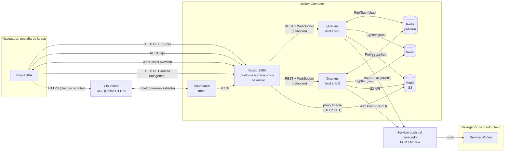
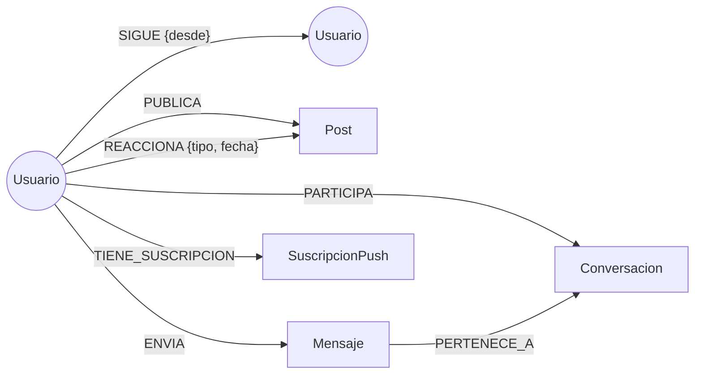
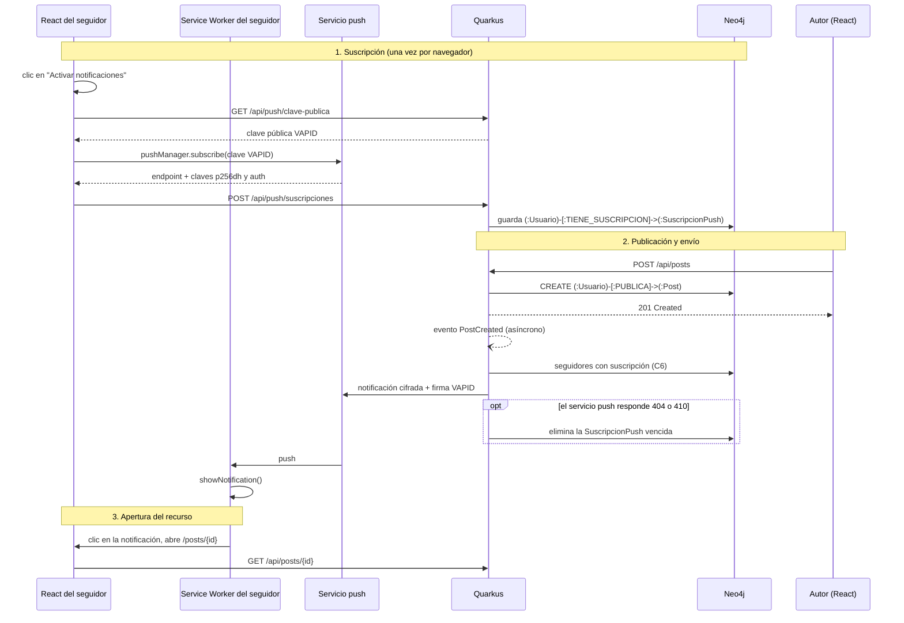

# Red Social Distribuida

Proyecto de la asignatura **Sistemas Distribuidos y Cloud Computing**.

Aplicación web distribuida que implementa las funcionalidades esenciales de una red social, integrando comunicación REST, WebSocket y Web Push, persistencia en una base de datos de grafos y almacenamiento de objetos compatible con S3.

## Integrantes

- Jose
- Luis
- Dayron

## Stack

| Componente | Tecnología |
|---|---|
| Frontend | React |
| Backend | Quarkus + Java |
| Base de datos de grafos | Neo4j |
| Almacenamiento de archivos | Object Storage compatible con S3 |
| Tiempo real | WebSocket |
| Notificaciones | Web Push |
| Despliegue | Docker Compose |

## Arquitectura

El navegador habla con un único punto de entrada (Nginx). Nginx sirve la SPA, reparte las peticiones entre dos instancias del backend y expone las imágenes de MinIO.
Las instancias persisten en Neo4j, guardan archivos en MinIO, se coordinan por Redis para el chat y envían notificaciones a través del servicio push del navegador.



- React SPA y Service Worker corren en el mismo navegador. Se dibujan separados porque el Service Worker sigue activo en segundo plano y recibe las notificaciones aunque la pestaña de la app esté cerrada.
- Las líneas punteadas muestran el camino de los clientes remotos: llevan el mismo tráfico (SPA, REST, WebSocket, imágenes) que un cliente local, pero entran por el túnel HTTPS.

### Qué viaja por cada canal

| Origen → Destino | Mecanismo | Qué transporta | Por qué este mecanismo |
|---|---|---|---|
| React → Quarkus (vía Nginx) | REST/HTTP | CRUD, feed, seguir, reacciones, historial del chat | Operaciones puntuales de pedido/respuesta, sin estado de conexión |
| React ↔ Quarkus (vía Nginx) | WebSocket | Mensajes de chat en tiempo real | Conexión persistente y bidireccional: el servidor envía sin que el cliente pregunte |
| Quarkus → Servicio push → Service Worker | Web Push | Aviso de nueva publicación | Llega aunque la app esté cerrada; el canal lo mantiene el navegador, no la aplicación |
| Quarkus → Neo4j | Bolt + Cypher | Usuarios, relaciones, posts, mensajes, suscripciones push | Los datos son relaciones: seguir, publicar, reaccionar |
| Quarkus → MinIO | S3 API | Archivos binarios (imágenes) | Los binarios no pertenecen a una base de datos |
| Navegador → MinIO (vía Nginx) | HTTP GET | Descarga de imágenes | El backend no tiene que retransmitir cada imagen |
| Quarkus ↔ Redis | Pub/Sub | Mensajes de chat entre instancias | Cada instancia solo conoce sus propias conexiones WebSocket; el broker las comunica |
| Cliente remoto → Cloudflare → `cloudflared` → Nginx | Túnel HTTPS | Todo el tráfico de la aplicación | Da un contexto seguro (HTTPS), requisito de Service Worker y Web Push, sin abrir puertos |

## Modelo del grafo



### Nodos

| Nodo | Propiedades |
|---|---|
| `Usuario` | `id` (UUID), `username`, `email`, `passwordHash`, `nombre`, `bio`, `avatarKey?`, `creadoEn` |
| `Post` | `id`, `texto`, `fecha`, `mediaKey?`, `mediaTipo?` |
| `Conversacion` | `id`, `creadaEn` |
| `Mensaje` | `id`, `texto`, `fecha` |
| `SuscripcionPush` | `endpoint`, `p256dh`, `auth`, `creadaEn` |

Las propiedades con `?` son opcionales.

### Relaciones

| Relación | Propiedades | Significado |
|---|---|---|
| `(:Usuario)-[:SIGUE]->(:Usuario)` | `desde` | Relación social principal |
| `(:Usuario)-[:PUBLICA]->(:Post)` | — | Autoría |
| `(:Usuario)-[:REACCIONA]->(:Post)` | `tipo`, `fecha` | Reacción (mínimo `LIKE`) |
| `(:Usuario)-[:PARTICIPA]->(:Conversacion)` | — | Integrantes de un chat |
| `(:Usuario)-[:ENVIA]->(:Mensaje)` | — | Autor del mensaje |
| `(:Mensaje)-[:PERTENECE_A]->(:Conversacion)` | — | Historial |
| `(:Usuario)-[:TIENE_SUSCRIPCION]->(:SuscripcionPush)` | — | Dispositivos que reciben Web Push |

### Constraints de unicidad

Se crean al iniciar el backend. Son idempotentes (`IF NOT EXISTS`), porque las dos instancias los ejecutan.

```cypher
CREATE CONSTRAINT usuario_id IF NOT EXISTS FOR (u:Usuario) REQUIRE u.id IS UNIQUE;
CREATE CONSTRAINT usuario_username IF NOT EXISTS FOR (u:Usuario) REQUIRE u.username IS UNIQUE;
CREATE CONSTRAINT usuario_email IF NOT EXISTS FOR (u:Usuario) REQUIRE u.email IS UNIQUE;
CREATE CONSTRAINT post_id IF NOT EXISTS FOR (p:Post) REQUIRE p.id IS UNIQUE;
CREATE CONSTRAINT conversacion_id IF NOT EXISTS FOR (c:Conversacion) REQUIRE c.id IS UNIQUE;
CREATE CONSTRAINT mensaje_id IF NOT EXISTS FOR (m:Mensaje) REQUIRE m.id IS UNIQUE;
CREATE CONSTRAINT suscripcion_endpoint IF NOT EXISTS FOR (s:SuscripcionPush) REQUIRE s.endpoint IS UNIQUE;
```

### Decisiones del modelo

| Decisión | Motivo |
|---|---|
| IDs UUID propios en la propiedad `id`, no el `elementId` interno de Neo4j | El identificador interno lo asigna la base y puede reutilizarse tras borrar nodos; un UUID propio es estable, sirve en las URLs de la API y está protegido por un constraint de unicidad |
| Una reacción por usuario y post, creada con `MERGE` | Reaccionar dos veces no duplica la relación; un reintento del cliente produce el mismo resultado |
| Chat uno a uno | Una conversación se inicia con un único `usuarioId` (`POST /api/conversaciones`) y la operación es idempotente: dos usuarios comparten una sola conversación |
| `Post.mediaKey` es la única referencia al archivo en MinIO | Guarda la clave del objeto (por ejemplo `posts/<postId>/<uuid>.jpg`), nunca el binario ni una URL absoluta |

### Criterio de recomendación

**Amigos de amigos, ordenados por cantidad de conexiones en común.**

1. Se toman los usuarios que siguen las personas que yo sigo (2 niveles).
2. Se excluye a uno mismo y a quienes ya sigo.
3. Se ordena por cuántas de mis conexiones siguen al candidato: más conexiones en común, más relevante.
4. En caso de empate, se prioriza al que tiene más seguidores.
5. **Arranque en frío:** si no sigo a nadie, se recomiendan los usuarios con más seguidores. Sigue saliendo del grafo, porque es el grado de entrada del nodo.
6. **Recomendación explicable:** la consulta devuelve hasta tres conexiones en común para mostrar *"Seguido por Luis, Dayron y 2 más"*. El usuario entiende el motivo y el recorrido del grafo queda visible en la interfaz.

### Consultas Cypher

Reglas que cumplen todas las consultas:

| Regla | Motivo |
|---|---|
| Devolver campos proyectados, nunca el nodo completo | El nodo `Usuario` contiene `passwordHash` |
| Usar siempre parámetros (`$userId`), nunca concatenar texto | Evita Cypher injection y permite reutilizar el plan de ejecución |
| Límite fijo de saltos en caminos de largo variable (3 en alcance, 6 en separación) | Cypher no admite parametrizarlo y los caminos crecen exponencialmente |
| Grados de separación sin dirección | Mide la cercanía entre usuarios sin importar quién sigue a quién |
| Cada consulta respalda un endpoint o flujo real | El enunciado no admite componentes decorativos |

Cobertura de los problemas que pide el enunciado:

| Problema solicitado | Consulta |
|---|---|
| Publicaciones de la red | C1 y C7 |
| Usuarios recomendados | C2 |
| Usuarios en común | C3 |
| Usuarios alcanzables | C4 |
| Extra: grados de separación | C5 |
| Seguidores de un usuario | C6 |

#### C1. Feed (2 niveles: usuario → seguidos → publicaciones)

```cypher
MATCH (yo:Usuario {id: $userId})-[:SIGUE]->(autor:Usuario)-[:PUBLICA]->(p:Post)
WITH yo, p, autor
ORDER BY p.fecha DESC
SKIP $skip LIMIT $limit
RETURN p.id AS id, p.texto AS texto, p.fecha AS fecha, p.mediaKey AS mediaKey,
       autor.id AS autorId, autor.username AS autorUsername,
       COUNT { (p)<-[:REACCIONA]-() } AS reacciones,
       EXISTS { (yo)-[:REACCIONA]->(p) } AS reaccionado
```

#### C2. Recomendaciones (2 niveles)

```cypher
MATCH (yo:Usuario {id: $userId})-[:SIGUE]->(intermedio:Usuario)-[:SIGUE]->(sug:Usuario)
WHERE sug <> yo AND NOT (yo)-[:SIGUE]->(sug)
WITH sug,
     count(DISTINCT intermedio) AS enComun,
     collect(DISTINCT intermedio.username)[..3] AS conexiones
WITH sug, enComun, conexiones, COUNT { (sug)<-[:SIGUE]-() } AS seguidores
ORDER BY enComun DESC, seguidores DESC
LIMIT 10
RETURN sug.id AS id, sug.username AS username, sug.nombre AS nombre,
       enComun, conexiones, seguidores
```

Arranque en frío (el usuario no sigue a nadie):

```cypher
MATCH (yo:Usuario {id: $userId}), (sug:Usuario)
WHERE sug <> yo AND NOT (yo)-[:SIGUE]->(sug)
WITH sug, COUNT { (sug)<-[:SIGUE]-() } AS seguidores
ORDER BY seguidores DESC
LIMIT 10
RETURN sug.id AS id, sug.username AS username, sug.nombre AS nombre,
       0 AS enComun, [] AS conexiones, seguidores
```

#### C3. Seguidos en común entre dos usuarios

```cypher
MATCH (a:Usuario {id: $userA})-[:SIGUE]->(comun:Usuario)<-[:SIGUE]-(b:Usuario {id: $userB})
RETURN comun.id AS id, comun.username AS username, comun.nombre AS nombre
ORDER BY username
```

#### C4. Usuarios alcanzables (hasta 3 niveles)

```cypher
MATCH camino = (yo:Usuario {id: $userId})-[:SIGUE*1..3]->(u:Usuario)
WHERE u <> yo
WITH u, min(length(camino)) AS distancia
RETURN u.id AS id, u.username AS username, u.nombre AS nombre, distancia
ORDER BY distancia, username
```

#### C5. Grados de separación entre dos usuarios

```cypher
MATCH (a:Usuario {id: $userA}), (b:Usuario {id: $userB})
MATCH camino = shortestPath((a)-[:SIGUE*..6]-(b))
RETURN [n IN nodes(camino) | n.username] AS cadena, length(camino) AS grados
```

#### C6. Seguidores a notificar cuando alguien publica (usada por Web Push)

```cypher
MATCH (autor:Usuario {id: $autorId})<-[:SIGUE]-(seg:Usuario)-[:TIENE_SUSCRIPCION]->(s:SuscripcionPush)
RETURN seg.id AS usuarioId, s.endpoint AS endpoint, s.p256dh AS p256dh, s.auth AS auth
```

#### C7. Descubrir: publicaciones que reaccionó mi red, de autores que no sigo

```cypher
MATCH (yo:Usuario {id: $userId})-[:SIGUE]->(amigo:Usuario)-[:REACCIONA]->(p:Post)<-[:PUBLICA]-(autor:Usuario)
WHERE autor <> yo AND NOT (yo)-[:SIGUE]->(autor)
WITH p, autor, count(DISTINCT amigo) AS amigosQueReaccionaron
ORDER BY amigosQueReaccionaron DESC, p.fecha DESC
LIMIT 10
RETURN p.id AS id, p.texto AS texto, p.fecha AS fecha, p.mediaKey AS mediaKey,
       autor.id AS autorId, autor.username AS autorUsername, amigosQueReaccionaron
```

## API REST

Todas las rutas usan el prefijo `/api`. Todas requieren JWT excepto registro, login, la clave pública VAPID, `/info` y la documentación.
El contrato completo, con esquemas de petición y respuesta, se publica en **Swagger UI: `/api/docs`** (`http://localhost:8080/api/docs`), generado desde el código con `quarkus-smallrye-openapi`.

### Endpoints

| Método | Ruta | Acceso | Descripción |
|---|---|---|---|
| POST | `/auth/registro` | Público | Crea un usuario |
| POST | `/auth/login` | Público | Devuelve un JWT |
| GET | `/usuarios/me` | JWT | Perfil propio |
| PUT | `/usuarios/me` | JWT | Edita el perfil |
| GET | `/usuarios?q=` | JWT | Busca usuarios |
| GET | `/usuarios/{id}` | JWT | Perfil de un usuario |
| POST | `/usuarios/{id}/seguir` | JWT | Seguir |
| DELETE | `/usuarios/{id}/seguir` | JWT | Dejar de seguir |
| GET | `/usuarios/{id}/seguidores` | JWT | Seguidores |
| GET | `/usuarios/{id}/seguidos` | JWT | Seguidos |
| GET | `/usuarios/{id}/en-comun` | JWT | Seguidos en común conmigo (C3) |
| GET | `/usuarios/{id}/separacion` | JWT | Grados de separación conmigo (C5) |
| GET | `/usuarios/me/sugerencias` | JWT | Recomendaciones (C2) |
| GET | `/usuarios/me/alcance` | JWT | Usuarios alcanzables (C4) |
| GET | `/usuarios/{id}/posts` | JWT | Publicaciones de un usuario |
| POST | `/posts` | JWT | Crea una publicación (`multipart/form-data`: `texto`, `archivo?`) |
| GET | `/posts/{id}` | JWT | Detalle de una publicación (destino de la notificación) |
| POST | `/posts/{id}/reacciones` | JWT | Reaccionar |
| DELETE | `/posts/{id}/reacciones` | JWT | Quitar la reacción |
| GET | `/feed?page=` | JWT | Feed personalizado (C1) |
| GET | `/descubrir` | JWT | Publicaciones de la red (C7) |
| GET | `/conversaciones` | JWT | Mis conversaciones |
| POST | `/conversaciones` | JWT | Inicia una conversación con `{ usuarioId }` |
| GET | `/conversaciones/{id}/mensajes?antes=` | JWT | Historial paginado |
| GET | `/push/clave-publica` | Público | Clave pública VAPID |
| POST | `/push/suscripciones` | JWT | Registra la suscripción del navegador |
| DELETE | `/push/suscripciones` | JWT | Elimina la suscripción |
| GET | `/info` | Público | Instancia que atendió la petición (demostración del balanceo) |
| GET | `/docs` | Público | Swagger UI |

### Decisiones

| Decisión | Motivo |
|---|---|
| Las operaciones propias usan `/me`; la identidad sale del JWT, nunca de la URL | Impide operar sobre recursos de otro usuario cambiando un `{id}` |
| Seguir, dejar de seguir y reaccionar son idempotentes (`MERGE`) | Un reintento del cliente ante un fallo de red produce el mismo resultado |
| Códigos HTTP estándar (`201`, `204`, `401`, `403`, `404`, `409`) y formato de error único `{ "error", "mensaje" }` | El frontend maneja todos los errores de la misma forma |
| Swagger UI generado con `quarkus-smallrye-openapi` en `/api/docs` | Contrato visible para el frontend, pruebas durante la demo y base de este README |
| Feed paginado con `?page=`; historial del chat paginado por cursor (`?antes=`) | En el feed un duplicado ocasional es aceptable; en el chat no |

### WebSocket del chat

**Conexión:** `ws://localhost:8080/ws/chat?token=<JWT>`

El token viaja en la query porque la API WebSocket del navegador no permite enviar cabeceras en el handshake.
Quarkus valida el JWT en el handshake y rechaza la conexión si es inválido.

**Cliente → servidor**

```json
{ "tipo": "mensaje", "conversacionId": "…", "texto": "Hola" }
```

**Servidor → clientes (todos los participantes conectados)**

```json
{ "tipo": "mensaje", "mensaje": { "id": "…", "conversacionId": "…", "autorId": "…", "texto": "Hola", "fecha": "…" } }
```

### Reparto entre REST y WebSocket

| Acción | Mecanismo | Motivo |
|---|---|---|
| Iniciar conversación (`POST /api/conversaciones`, idempotente) | REST | Operación puntual con respuesta |
| Consultar historial (`GET /api/conversaciones/{id}/mensajes`) | REST | Lectura de datos persistidos |
| Enviar y recibir mensajes | WebSocket | El servidor entrega mensajes sin que el cliente los solicite |

**Diferencia entre ambos mecanismos:**

- **REST** es pedido/respuesta: el cliente siempre inicia, cada petición es independiente y lleva su JWT, y el servidor no guarda estado de conexión. Sirve para leer y modificar datos persistidos.
- **WebSocket** es una conexión persistente y bidireccional: se abre una vez y, desde entonces, el servidor puede enviar datos cuando ocurre algo, sin que el cliente pregunte y sin polling. A cambio, la conexión es estado que vive en una instancia concreta, y por eso hace falta Redis para comunicar instancias.

En el chat, el tiempo real va por WebSocket y lo persistente por REST: el historial se consulta por REST al abrir la conversación y los mensajes nuevos llegan por WebSocket.

### Web Push

Una publicación nueva notifica a los seguidores del autor aunque tengan la aplicación cerrada. El flujo tiene tres fases: suscripción, evento de publicación con envío, y apertura del recurso.



- **Suscripción:** el permiso se solicita desde un botón **"Activar notificaciones"**, porque los navegadores bloquean o silencian las solicitudes que no provienen de una acción del usuario. La suscripción (`endpoint`, `p256dh`, `auth`) se guarda en el grafo como `SuscripcionPush`.
- **Evento de publicación:** la respuesta al autor no espera el envío de notificaciones. El módulo de publicaciones emite el evento `PostCreated` y el módulo de notificaciones lo consume de forma asíncrona.
- **Envío:** el payload `{ titulo, cuerpo, url }` se cifra con las claves de la suscripción y se firma con VAPID; el servicio push lo transporta sin poder leerlo. Si responde `404` o `410`, la suscripción expiró y se elimina del grafo.
- **Apertura del recurso:** al hacer clic, el Service Worker abre `/posts/{id}` o enfoca la pestaña si ya está abierta.

### Contrato interno `PostCreated` (issues #9 y #10)

`com.redsocial.shared.PostCreated` es un record con `String postId`, `String authorId` y `String text` (texto validado sin espacios extremos). Publicaciones lo emite mediante CDI `Event<PostCreated>.fireAsync(...)` **después de confirmar la escritura en Neo4j**, fuera de la transacción que el driver puede reintentar. Si falla la validación, la subida o la persistencia, no se emite.

Notificaciones podrá recibirlo con `void onPost(@ObservesAsync PostCreated event)`. El consumidor debe usar `authorId`, sin depender del JWT ni del contexto HTTP. La respuesta `201` no espera al consumidor; sus errores se registran y no deshacen la publicación. Es un evento local en memoria, sin entrega durable ni reintento automático ante caída del proceso; no usa Redis ni envía todavía Web Push.

### Publicaciones e imágenes (issue #10)

Los tres endpoints requieren JWT: `POST /api/posts`, `GET /api/posts/{id}` y `GET /api/usuarios/{id}/posts?page=0`.

- El POST recibe `multipart/form-data`: `texto` obligatorio (1–5000 caracteres, sin espacios extremos) y `archivo` opcional. Admite PNG, JPEG y GIF, hasta **5 MiB**; verifica contenido y MIME, y limita el primer fotograma a 20 megapíxeles. No admite SVG. Estos límites acotan el almacenamiento y la memoria de validación.
- La imagen se guarda mediante `MediaStorage` en el bucket `media`, con clave `posts/<postId>/<uuid>.<ext>`. Neo4j conserva la relación `PUBLICA`, el texto, la fecha y las referencias `mediaKey`/`mediaTipo`. Si falla la escritura del grafo, se intenta eliminar el objeto subido; un fallo de limpieza queda en logs para revisión.
- Respuesta: `{ id, texto, fecha, autor: { id, username, nombre }, mediaKey, mediaTipo, mediaUrl }`. Los tres campos media son `null` sin imagen. `mediaUrl` se construye con `MEDIA_PUBLIC_URL` (por defecto `/media/`) y la clave; la URL no se guarda en el grafo.
- El listado devuelve un array de hasta 20 elementos por página, desde 0, ordenado por fecha e id descendentes. Menos de 20 elementos indica el final; un usuario sin publicaciones devuelve `[]`. Un usuario o post inexistente devuelve `404`.

Swagger describe los campos y errores en `/api/docs`. En desarrollo con Vite, `/media/` se resuelve mediante su proxy; para acceder directamente a MinIO se puede configurar `MEDIA_PUBLIC_URL=http://localhost:9000/media/` en el backend. Para el despliegue completo, el PR #22 incluye el límite de 6 MiB en Nginx (5 MiB de archivo más el formulario) y pasa `MEDIA_PUBLIC_URL` al backend. Este módulo puede desarrollarse y probarse sin ese proxy.

## Infraestructura base (issue #4)

Se configuró Docker Compose con Neo4j, MinIO y Redis, una red compartida, comprobaciones de salud y creación automática del bucket `media`.

### Puesta en marcha para el equipo

Después de clonar el repositorio, abrir Docker Desktop con contenedores Linux y copiar la plantilla desde la carpeta raíz del proyecto:

```powershell
Copy-Item .env.example .env
```

La copia de `.env` se hace solo la primera vez; si ya existe, conservar sus valores. En Linux o macOS se puede usar `cp .env.example .env`. El archivo `.env` contiene la configuración local y no se sube a Git.

La plantilla incluye valores predeterminados de desarrollo, compartidos con el equipo. Antes del primer arranque, sustituir las contraseñas de `NEO4J_PASSWORD` y `MINIO_ROOT_PASSWORD` en `.env` por contraseñas propias de al menos 8 caracteres. El usuario de MinIO (`MINIO_ROOT_USER`) debe tener al menos 3 caracteres. Compose exige credenciales no vacías; las variables VAPID se mantienen vacías hasta integrar Web Push.

Con la configuración completa, ejecutar:

```sh
docker compose up -d --build neo4j redis minio minio-init
docker compose ps -a
```

Si Neo4j ya tiene datos, editar `.env` no cambia su contraseña: primero debe actualizarse dentro de la base existente.

Para ejecutar el backend desde la terminal o el IDE, seguir el [modo desarrollo del backend](backend/README.md#modo-desarrollo): usar `docker-compose.dev.yml` junto al Compose base y configurar `backend/.env` con las credenciales de tu `.env` raíz. Ese modo habilita Redis y la API de MinIO solo en la propia computadora (`127.0.0.1`). Cada integrante utiliza sus propios contenedores y datos.

El primer arranque requiere internet y tarda más porque descarga dependencias y compila MinIO automáticamente. No hace falta instalar Go ni MinIO en la laptop. Las siguientes ejecuciones reutilizan las imágenes construidas.

Esperar a que Neo4j, MinIO y Redis aparezcan como `healthy`. El servicio `minio-init` debe mostrar `Exited (0)`: significa que creó o verificó el bucket y terminó correctamente.

| Acceso | Inicio de sesión |
|---|---|
| [Neo4j Browser](http://localhost:7474) | Conexión `bolt://localhost:7687`, usuario `neo4j` y valor de `NEO4J_PASSWORD` en `.env` |
| [Consola MinIO](http://localhost:9001) | Valores de `MINIO_ROOT_USER` y `MINIO_ROOT_PASSWORD` en `.env` |

En MinIO debe aparecer el bucket `media`. Redis funciona internamente y no tiene consola web. Si los puertos `7474`, `7687` o `9001` están ocupados, cambiar sus variables en `.env` y ajustar las direcciones de acceso.

Para revisar un fallo de arranque: `docker compose logs --tail=50`. Para detener el entorno conservando los datos: `docker compose down`.

### Decisiones técnicas

- Neo4j y MinIO conservan datos en volúmenes; Redis funciona solo en memoria para Pub/Sub.
- El bucket `media` permite lectura pública y requiere autenticación para escribir.
- MinIO y `mc` se construyen desde revisiones fijas del código oficial, debido a la indisponibilidad de las imágenes previstas. Así todos usan las mismas fuentes.

### Aplicación completa con Nginx (issue #12)

Con `.env` preparado, generar una sola vez el par RSA en `backend/keys/` siguiendo el [README del backend](backend/README.md#claves-jwt-para-docker). Conservar las claves entre arranques; Compose las monta en `/keys` como solo lectura y no se suben a Git.

Desde la raíz:

```sh
docker compose up -d --build
docker compose ps -a
curl http://localhost:8080/api/info
```

Abrir `http://localhost:8080`; `/api/info` debe devolver `{"instancia":"backend-1"}`. Nginx sirve la SPA y dirige `/api` y `/ws` al backend, y `/media/<clave>` al bucket `media` de MinIO. La API recibe automáticamente las credenciales de `.env` y se conecta por los nombres internos de Docker. No necesita `backend/.env` en este modo.

El backend espera a Neo4j, Redis y MinIO saludables y a que `minio-init` finalice correctamente. Nginx espera al backend saludable en `/q/health`. Solo Nginx publica el puerto de aplicación `8080`; los puertos locales de administración de Neo4j y MinIO se conservan para la demo. La segunda instancia, el balanceo y el chat corresponden a tareas posteriores.

Para desarrollo con Quarkus fuera de Docker, detener primero el entorno completo (`docker compose down`, conserva datos) y seguir el modo desarrollo del backend, que inicia únicamente la infraestructura y evita ocupar el puerto `8080` con Nginx.

## Flujo de trabajo

Las ramas de trabajo parten de `develop` y los PR se dirigen a `develop`. La rama `main` se reserva para las versiones listas para la entrega.

Cada PR y cada push a `develop` o `main` ejecutan la integración continua (`.github/workflows/ci.yml`) en GitHub Actions:

| Job | Validación |
|---|---|
| Backend (Quarkus) | `./mvnw -B -ntp verify` con Java 21; las pruebas levantan Neo4j y Redis con Dev Services |
| Frontend (React) | `npm run check` (lint, validación de componentes, pruebas y build) y `npm run format:check` |
| Docker Compose config | `docker compose config` del archivo base y del modo desarrollo con los valores de `.env.example` |

Un PR se integra cuando los tres jobs pasan. El archivo `.gitattributes` fija finales de línea LF para que las copias en Windows coincidan con el formateador y con los contenedores Linux.
