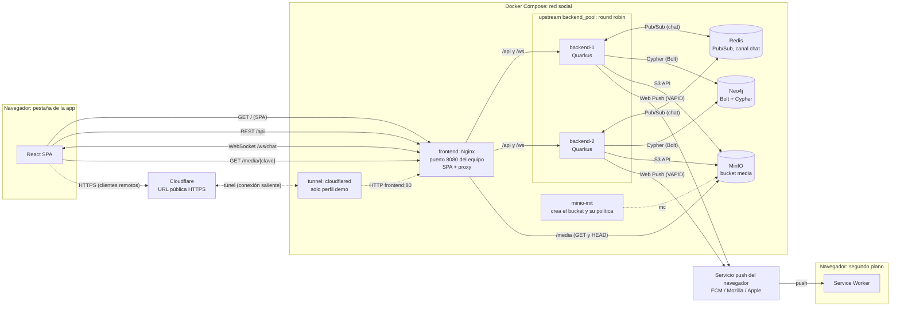
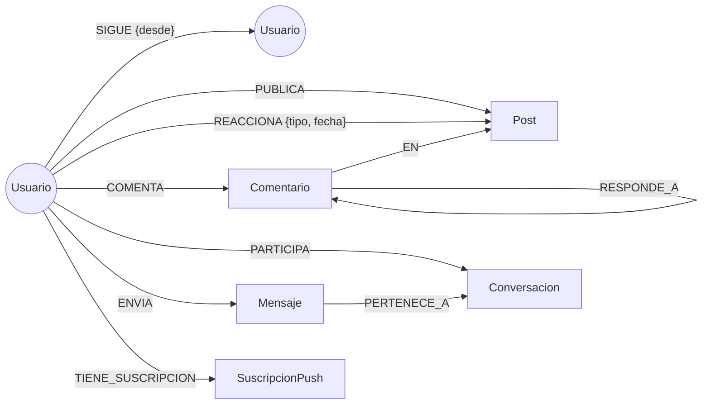

# Red Social Distribuida

Proyecto de la asignatura **Sistemas Distribuidos y Cloud Computing**.

## Integrantes

| Integrante | GitHub | Rol |
|---|---|---|
| Jose | [@Joseepc18](https://github.com/Joseepc18) | Backend: autenticación, perfiles, grafo social, reacciones y Web Push |
| Dayron | [@DayronQV](https://github.com/DayronQV) | Backend e infraestructura: Docker Compose, Nginx, publicaciones y S3, feed, chat |
| Luis | [@LuisAnchundia](https://github.com/LuisAnchundia) | Frontend: React, diseño, pantallas, Service Worker y cliente WebSocket |

## Descripción

Aplicación web distribuida con las funcionalidades esenciales de una red social: registro e inicio de sesión, perfiles, seguimiento entre usuarios, publicaciones con imagen, feed, reacciones, comentarios con hilos de respuestas, recomendaciones, chat en tiempo real y notificaciones push.

Cada componente tiene una responsabilidad propia. El navegador se comunica por REST, WebSocket y Web Push; los datos y sus relaciones viven en Neo4j; los archivos, en un almacenamiento compatible con S3 (MinIO). Dos instancias del backend se coordinan mediante Redis, y todo el entorno se levanta con Docker Compose.

## Arquitectura

El navegador habla con un único punto de entrada: Nginx. Nginx sirve la SPA, reparte `/api` y `/ws` entre las dos instancias del backend y envía `/media` al bucket de MinIO.



- La SPA y el Service Worker corren en el mismo navegador. Se dibujan por separado porque el Service Worker recibe las notificaciones aunque la pestaña esté cerrada.
- Las líneas punteadas son el camino de los clientes remotos: el mismo tráfico, pero por HTTPS a través de `cloudflared`, que solo arranca con el perfil `demo`.
- Solo Nginx publica el puerto de la aplicación (`8080`). Neo4j y la consola de MinIO se publican únicamente en `127.0.0.1` para administración; Redis y la API S3 de MinIO no se publican.

| Origen → Destino | Mecanismo | Qué transporta | Por qué |
|---|---|---|---|
| React → Quarkus (vía Nginx) | REST/HTTP | CRUD, feed, seguir, reacciones, historial del chat | Operaciones puntuales de pedido y respuesta |
| React ↔ Quarkus (vía Nginx) | WebSocket | Mensajes de chat | Conexión persistente: el servidor envía sin que el cliente pregunte |
| Quarkus → Servicio push → Service Worker | Web Push | Aviso de nueva publicación | Llega con la app cerrada; el canal lo mantiene el navegador |
| Quarkus → Neo4j | Bolt + Cypher | Usuarios, relaciones, posts, mensajes, suscripciones | Los datos son relaciones |
| Quarkus → MinIO | S3 API | Imágenes | Los binarios no pertenecen a una base de datos |
| Navegador → MinIO (vía Nginx) | HTTP GET | Descarga de imágenes | El backend no retransmite cada imagen |
| Quarkus ↔ Redis | Pub/Sub | Mensajes de chat entre instancias | Cada instancia solo conoce sus propios sockets |

## Tecnologías utilizadas

| Capa | Tecnología |
|---|---|
| Frontend | React 19 + TypeScript, Vite, React Router, Service Worker + Push API |
| Backend | Java 21, Quarkus 3.33 (LTS), Maven |
| REST y documentación | Quarkus REST + Jackson, Hibernate Validator, SmallRye OpenAPI (Swagger UI en `/api/docs`) |
| WebSocket | Quarkus WebSockets Next |
| Seguridad | SmallRye JWT (RSA), bcrypt |
| Base de datos de grafos | Neo4j 5 Community, driver `quarkus-neo4j` |
| Almacenamiento de objetos | MinIO (compatible con S3), cliente `quarkus-amazon-s3` |
| Mensajería entre instancias | Redis 7 Pub/Sub |
| Web Push | VAPID, `nl.martijndwars:web-push` |
| Proxy, balanceo y túnel | Nginx, `cloudflared` |
| Despliegue | Docker Compose |
| Pruebas e integración continua | JUnit + REST Assured + Dev Services, Vitest, Playwright, GitHub Actions |

## Instrucciones de ejecución

### Requisitos

- Docker Desktop (contenedores Linux) o Docker Engine con Compose v2.
- Node.js 18 o superior para generar las claves VAPID y cargar los datos de demostración.

### Configuración inicial (una sola vez)

1. Copiar la plantilla de variables. Los valores predeterminados sirven para desarrollo local; `.env` no se sube a Git.

   ```sh
   cp .env.example .env
   ```

   En PowerShell: `Copy-Item .env.example .env`.

2. Generar el par de claves JWT en `backend/keys/`. Ambas instancias del backend lo comparten; no se versiona y no debe regenerarse en cada arranque, porque invalidaría los tokens emitidos.

   ```sh
   cd backend && mkdir -p keys
   openssl genpkey -algorithm RSA -pkeyopt rsa_keygen_bits:2048 -out keys/privateKey.pem
   openssl pkey -in keys/privateKey.pem -pubout -out keys/publicKey.pem
   ```

   Alternativa en PowerShell 7, desde `backend/` y sin OpenSSL:

   ```powershell
   New-Item -ItemType Directory -Force keys | Out-Null
   $rsa = [System.Security.Cryptography.RSA]::Create(2048)
   [IO.File]::WriteAllText((Join-Path $PWD 'keys/privateKey.pem'), $rsa.ExportPkcs8PrivateKeyPem())
   [IO.File]::WriteAllText((Join-Path $PWD 'keys/publicKey.pem'), $rsa.ExportSubjectPublicKeyInfoPem())
   $rsa.Dispose()
   ```

3. Generar las claves VAPID y copiarlas en `.env` (`VAPID_PUBLIC_KEY`, `VAPID_PRIVATE_KEY` y `VAPID_SUBJECT=mailto:<correo>`). Sin ellas la aplicación arranca igual, pero no envía notificaciones.

   ```sh
   npx web-push generate-vapid-keys
   ```

### Levantar la aplicación

```sh
docker compose up -d --build
docker compose ps -a
```

El primer arranque tarda más porque descarga dependencias y compila MinIO desde su código fuente. Todos los servicios deben quedar `healthy`, y `minio-init` en `Exited (0)` después de crear el bucket.

| Acceso | Dirección | Credenciales |
|---|---|---|
| Aplicación | `http://localhost:8080` | Cuenta registrada o usuarios de demostración |
| Swagger UI | `http://localhost:8080/api/docs` | Botón **Authorize** con el JWT de `POST /api/auth/login` |
| Neo4j Browser | `http://localhost:7474` | Usuario `neo4j` y `NEO4J_PASSWORD` de `.env` |
| Consola MinIO | `http://localhost:9001` | `MINIO_ROOT_USER` y `MINIO_ROOT_PASSWORD` de `.env` |

Para ver el balanceo, repetir `curl http://localhost:8080/api/info`: responden `backend-1` y `backend-2` alternadamente. Para detener el entorno conservando los datos: `docker compose down`.

### Datos de demostración

`scripts/seed-demo.mjs` crea 10 usuarios, seguimientos, 12 publicaciones (4 con imagen), reacciones y comentarios **usando la API REST**, igual que un usuario real. Parte de una base vacía; `down -v` borra los volúmenes de Neo4j y MinIO.

```sh
docker compose down -v
docker compose up -d --build
node scripts/seed-demo.mjs
```

Todos los usuarios usan la contraseña `Demo2026!`. `ana` es la usuaria principal: sigue a `bruno` y `carla`. `diego` es su mejor sugerencia (2 conexiones en común), `gabriela` y `hector` están a 3 niveles, `irene` a 4 grados y `julian` no tiene conexiones. La publicación de `carla` sobre el parcial tiene un hilo de comentarios de 3 niveles (C8).

### Acceso remoto por HTTPS

Web Push exige HTTPS fuera de `localhost`. `docker compose --profile demo up -d --build` abre además un túnel de Cloudflare; su URL `https://<aleatorio>.trycloudflare.com` aparece en `docker compose logs tunnel`.

### Pruebas

| Comando | Qué valida |
|---|---|
| `./mvnw verify` (en `backend/`, requiere Java 21) | API y consultas Cypher contra Neo4j y Redis reales, levantados en contenedores temporales |
| `npm run check` (en `frontend/`, requiere Node.js 22.12) | Lint, pruebas con Vitest, TypeScript y compilación |

GitHub Actions ejecuta ambas suites y `docker compose config` en cada PR y en cada push a `develop` o `main`.

## Variables de entorno

Se definen en `.env` (plantilla en `.env.example`). Compose las pasa a los servicios y a ambos backends.

| Variables | Uso |
|---|---|
| `NEO4J_PASSWORD` | Contraseña de Neo4j |
| `MINIO_ROOT_USER`, `MINIO_ROOT_PASSWORD` | Credenciales de MinIO; el backend las usa como claves S3 |
| `NEO4J_HTTP_PORT`, `NEO4J_BOLT_PORT`, `MINIO_CONSOLE_PORT` | Puertos de administración (7474, 7687 y 9001 por defecto) |
| `MEDIA_PUBLIC_URL` | Prefijo público de las imágenes (`/media/` por defecto) |
| `VAPID_PUBLIC_KEY`, `VAPID_PRIVATE_KEY`, `VAPID_SUBJECT` | Claves de Web Push; vacías por defecto |
| `SEED_BASE_URL` | URL del script de demostración (`http://localhost:8080` por defecto) |

Compose define además las variables internas de cada backend: `INSTANCE_ID`, `NEO4J_URI`, `REDIS_HOST`, `MINIO_ENDPOINT` y la ubicación de las claves JWT (`/keys`).

## Modelo del grafo



| Nodo | Propiedades |
|---|---|
| `Usuario` | `id` (UUID), `username`, `email`, `passwordHash`, `nombre`, `bio`, `creadoEn` |
| `Post` | `id`, `texto`, `fecha`, `mediaKey?`, `mediaTipo?` |
| `Comentario` | `id`, `texto`, `fecha` |
| `Conversacion` | `id`, `creadaEn` |
| `Mensaje` | `id`, `texto`, `fecha` |
| `SuscripcionPush` | `endpoint`, `p256dh`, `auth`, `creadaEn` |

| Relación | Significado |
|---|---|
| `(:Usuario)-[:SIGUE {desde}]->(:Usuario)` | Relación social principal |
| `(:Usuario)-[:PUBLICA]->(:Post)` | Autoría |
| `(:Usuario)-[:REACCIONA {tipo, fecha}]->(:Post)` | Reacción, una por usuario y post |
| `(:Usuario)-[:COMENTA]->(:Comentario)-[:EN]->(:Post)` | Autor de un comentario directo a la publicación |
| `(:Usuario)-[:COMENTA]->(:Comentario)-[:RESPONDE_A]->(:Comentario)` | Respuesta a otro comentario; solo apunta a su comentario padre |
| `(:Usuario)-[:PARTICIPA]->(:Conversacion)` | Integrantes de un chat uno a uno |
| `(:Usuario)-[:ENVIA]->(:Mensaje)-[:PERTENECE_A]->(:Conversacion)` | Autor e historial de cada mensaje |
| `(:Usuario)-[:TIENE_SUSCRIPCION]->(:SuscripcionPush)` | Dispositivos que reciben Web Push |

Los archivos no se guardan en el grafo: `Post.mediaKey` es la clave del objeto en MinIO (por ejemplo `posts/<postId>/<uuid>.jpg`). Al arrancar, el backend crea restricciones de unicidad (`IF NOT EXISTS`) sobre los `id` de cada nodo, `username`, `email` y el `endpoint` de las suscripciones.

## Endpoints principales

Todas las rutas usan el prefijo `/api` y requieren `Authorization: Bearer <JWT>`, excepto las marcadas como públicas. El contrato completo, con esquemas de petición y respuesta, está en **Swagger UI (`/api/docs`)**, generado desde el código.

| Método | Ruta | Descripción |
|---|---|---|
| POST | `/auth/registro` | Crea un usuario (público) |
| POST | `/auth/login` | Devuelve un JWT (público) |
| GET, PUT | `/usuarios/me` | Perfil propio y su edición |
| GET | `/usuarios?q=` | Busca usuarios por username o nombre |
| GET | `/usuarios/{id}` | Perfil de un usuario |
| POST, DELETE | `/usuarios/{id}/seguir` | Seguir y dejar de seguir |
| GET | `/usuarios/{id}/seguidores`, `/usuarios/{id}/seguidos` | Seguidores y seguidos |
| GET | `/usuarios/{id}/en-comun` | Seguidos en común conmigo (C3) |
| GET | `/usuarios/{id}/separacion` | Grados de separación conmigo (C5) |
| GET | `/usuarios/me/sugerencias` | Recomendaciones (C2) |
| GET | `/usuarios/me/alcance` | Usuarios alcanzables (C4) |
| GET | `/usuarios/{id}/posts?page=` | Publicaciones de un usuario |
| POST | `/posts` | Crea una publicación (`multipart/form-data`: `texto`, `archivo?`) |
| GET | `/posts/{id}` | Detalle de una publicación (destino de la notificación) |
| POST, DELETE | `/posts/{id}/reacciones` | Reaccionar y quitar la reacción |
| GET, POST | `/posts/{id}/comentarios` | Hilo de comentarios (C8) y comentar o responder con `{ texto, respondeA? }` |
| GET | `/feed?page=` | Feed personalizado (C1) |
| GET | `/descubrir?page=` | Publicaciones que reaccionó mi red (C7), en páginas de 20 como el feed |
| GET, POST | `/conversaciones` | Mis conversaciones e iniciar una con `{ usuarioId }` |
| GET | `/conversaciones/{id}/mensajes?antes=` | Historial paginado del chat |
| GET | `/push/clave-publica` | Clave pública VAPID (público) |
| POST, DELETE | `/push/suscripciones` | Registrar o eliminar la suscripción del navegador |
| GET | `/info` | Instancia que atendió la petición (público) |
| WS | `/ws/chat?token=<JWT>` | Chat en tiempo real |

Los errores usan códigos HTTP estándar y un formato único: `{ "error": "CODIGO", "mensaje": "Texto para el usuario" }`.

## Uso de REST

**Problema que resuelve:** las operaciones puntuales que inicia el usuario y que esperan una respuesta concreta: registrarse, seguir, publicar, reaccionar, consultar el feed o el historial del chat.

REST es pedido y respuesta: el cliente siempre inicia, cada petición lleva su JWT y el servidor no guarda estado de conexión. Por eso cualquiera de las dos instancias puede atender cualquier petición y Nginx las reparte en round robin.

**Ejemplo, publicar con imagen:** React envía `POST /api/posts` (multipart) → Nginx lo pasa a una instancia → Quarkus valida el JWT y la imagen, la sube a MinIO por la API S3 y crea `(:Usuario)-[:PUBLICA]->(:Post {mediaKey})` en Neo4j → responde `201`. Después, el navegador descarga la imagen con `GET /media/<clave>`, que Nginx sirve desde MinIO sin pasar por Quarkus.

## Uso de WebSocket

**Problema que resuelve:** en el chat, el servidor tiene que entregar un mensaje en cuanto otro usuario lo envía, sin que el receptor pregunte. Con REST habría que consultar cada pocos segundos (polling), con retraso y peticiones inútiles. WebSocket abre una conexión persistente y bidireccional: se establece una vez y desde entonces el servidor envía datos cuando ocurre algo.

| Acción | Mecanismo |
|---|---|
| Iniciar una conversación y consultar el historial | REST (`/api/conversaciones`) |
| Enviar y recibir mensajes | WebSocket (`/ws/chat`) |

**Flujo de un mensaje:** el cliente abre `/ws/chat?token=<JWT>` (la API WebSocket del navegador no permite cabeceras, por eso el token va en la query) → envía `{ tipo: "mensaje", conversacionId, texto }` → la instancia lo guarda en Neo4j como `(:Usuario)-[:ENVIA]->(:Mensaje)-[:PERTENECE_A]->(:Conversacion)` → lo publica en el canal `chat` de Redis → cada instancia lo entrega a los participantes conectados **a ella**.

Redis es necesario porque cada instancia solo conoce sus propios sockets: si los dos usuarios están en instancias distintas, sin Redis el mensaje no llegaría. Si una instancia cae, sus clientes se reconectan a la otra y recargan el historial por REST. No hay polling.

## Uso de Web Push

**Problema que resuelve:** avisar a los seguidores de que alguien publicó, **aunque tengan la aplicación cerrada**. REST y WebSocket necesitan una pestaña abierta. Web Push usa un canal que mantiene el propio navegador con su servicio push (FCM, Mozilla, Apple); ese servicio despierta al Service Worker, que muestra la notificación.

1. **Suscripción:** al pulsar **Activar notificaciones** (en **Configuración**), el navegador se suscribe con la clave pública VAPID y React envía `{ endpoint, p256dh, auth }` a `POST /api/push/suscripciones`. Se guarda como `(:Usuario)-[:TIENE_SUSCRIPCION]->(:SuscripcionPush)`.
2. **Publicación:** al guardar un post, el backend responde `201` sin esperar y emite el evento asíncrono `PostCreated`.
3. **Envío:** el módulo de notificaciones consume el evento, busca los seguidores suscritos (C6) y envía `{ titulo, cuerpo, url }` al servicio push, cifrado con las claves de cada suscripción y firmado con VAPID. Si el servicio responde `404` o `410`, la suscripción vencida se borra.
4. **Apertura:** el Service Worker muestra la notificación; al hacer clic abre `/posts/{id}`.

## Consultas Cypher

Las ocho consultas respaldan endpoints o flujos reales de la aplicación. Todas usan parámetros, devuelven campos proyectados (nunca el nodo completo, que incluye `passwordHash`) y fijan un límite de saltos en los caminos de largo variable.

| Problema que pide el enunciado | Consulta |
|---|---|
| Publicaciones de la red de un usuario | C1 y C7 |
| Usuarios recomendados | C2 |
| Usuarios en común | C3 |
| Usuarios alcanzables | C4 |
| Seguidores de un usuario | C6 |
| Extra: grados de separación | C5 |
| Extra: hilos de comentarios | C8 |

**Ejecutarlas:** con los datos de demostración cargados, abrir Neo4j Browser y ejecutar [`consultas-demo.cypher`](consultas-demo.cypher) en orden: primero cada `:param` (busca los UUID por nombre de usuario) y después su consulta. La última consulta del archivo dibuja el grafo completo en la vista **Graph**.

### Criterio de recomendación

**Amigos de amigos, ordenados por conexiones en común.** Se toman los usuarios que siguen las personas que sigo (2 niveles), se excluye a uno mismo y a quienes ya sigo, y se ordena por cuántas de mis conexiones siguen al candidato; en caso de empate, por cantidad de seguidores. Si el usuario no sigue a nadie (arranque en frío), se recomiendan los usuarios con más seguidores, un dato que también sale del grafo. La consulta devuelve hasta tres conexiones en común para que la interfaz explique la sugerencia: *"Seguido por bruno y carla"*.

### C1. Feed (2 niveles: usuario → seguidos → publicaciones)

```cypher
MATCH (yo:Usuario {id: $viewerId})-[:SIGUE]->(autor:Usuario)-[:PUBLICA]->(p:Post)
WITH p, autor
ORDER BY p.fecha DESC, p.id DESC
SKIP $skip LIMIT $limit
RETURN p.id AS id, p.texto AS texto, toString(p.fecha) AS fecha,
       p.mediaKey AS mediaKey, p.mediaTipo AS mediaTipo,
       autor.id AS autorId, autor.username AS username, autor.nombre AS nombre,
       COUNT { (p)<-[:REACCIONA]-() } AS reacciones,
       EXISTS { (:Usuario {id: $viewerId})-[:REACCIONA]->(p) } AS reaccionado,
       COUNT { (p)<-[:EN]-(:Comentario)<-[:RESPONDE_A*0..50]-(:Comentario) } AS comentarios
ORDER BY p.fecha DESC, p.id DESC
```

El `RETURN` es la proyección única de una publicación (`PostRepository.PUBLIC_FIELDS`): C1, C7, el detalle y el perfil la reutilizan, así que todas las vistas devuelven los mismos campos y contadores, y un campo nuevo se agrega una sola vez. `comentarios` cuenta también las respuestas: en un árbol hay un solo camino hasta cada comentario.

### C2. Recomendaciones (2 niveles)

```cypher
MATCH (yo:Usuario {id: $userId})-[:SIGUE]->(intermedio:Usuario)-[:SIGUE]->(sug:Usuario)
WHERE sug <> yo AND NOT (yo)-[:SIGUE]->(sug)
WITH sug,
     count(DISTINCT intermedio) AS enComun,
     collect(DISTINCT intermedio.username)[..3] AS conexiones
WITH sug, enComun, conexiones, COUNT { (sug)<-[:SIGUE]-() } AS seguidores
ORDER BY enComun DESC, seguidores DESC
LIMIT 10
RETURN sug.id AS id, sug.username AS username, sug.nombre AS nombre,
       enComun, conexiones, seguidores
```

La variante de arranque en frío ordena a todos los usuarios no seguidos por `COUNT { (sug)<-[:SIGUE]-() }`; está en `consultas-demo.cypher`.

### C3. Seguidos en común entre dos usuarios

```cypher
MATCH (a:Usuario {id: $userA})-[:SIGUE]->(comun:Usuario)<-[:SIGUE]-(b:Usuario {id: $userB})
RETURN comun.id AS id, comun.username AS username, comun.nombre AS nombre
ORDER BY username
```

### C4. Usuarios alcanzables (hasta 3 niveles)

```cypher
MATCH camino = (yo:Usuario {id: $userId})-[:SIGUE*1..3]->(u:Usuario)
WHERE u <> yo
WITH u, length(camino) AS distancia, [n IN nodes(camino)[1..-1] | n.username] AS via
ORDER BY distancia, via
WITH u, collect({distancia: distancia, via: via})[0] AS masCorto
RETURN u.id AS id, u.username AS username, u.nombre AS nombre,
       masCorto.distancia AS distancia, masCorto.via AS via
ORDER BY distancia, username
```

`via` lista los usuarios intermedios del camino más corto (vacía a distancia 1). Si hay varios caminos igual de cortos, se queda con el primero ordenado por esos usernames, así la respuesta no cambia entre llamadas.

### C5. Grados de separación entre dos usuarios

```cypher
MATCH (a:Usuario {id: $userA}), (b:Usuario {id: $userB})
MATCH camino = shortestPath((a)-[:SIGUE*..6]-(b))
RETURN [n IN nodes(camino) | n.username] AS cadena, length(camino) AS grados
```

### C6. Seguidores a notificar cuando alguien publica (Web Push)

```cypher
MATCH (autor:Usuario {id: $autorId})<-[:SIGUE]-(seg:Usuario)-[:TIENE_SUSCRIPCION]->(s:SuscripcionPush)
RETURN seg.id AS usuarioId, s.endpoint AS endpoint, s.p256dh AS p256dh, s.auth AS auth
```

### C7. Descubrir: publicaciones que reaccionó mi red, de autores que no sigo

```cypher
MATCH (yo:Usuario {id: $viewerId})-[:SIGUE]->(amigo:Usuario)
      -[:REACCIONA]->(p:Post)<-[:PUBLICA]-(autor:Usuario)
WHERE autor <> yo AND NOT (yo)-[:SIGUE]->(autor)
WITH p, autor, count(DISTINCT amigo) AS amigosQueReaccionaron
ORDER BY amigosQueReaccionaron DESC, p.fecha DESC, p.id DESC
SKIP $skip LIMIT $limit
RETURN p.id AS id, p.texto AS texto, toString(p.fecha) AS fecha,
       p.mediaKey AS mediaKey, p.mediaTipo AS mediaTipo,
       autor.id AS autorId, autor.username AS username, autor.nombre AS nombre,
       COUNT { (p)<-[:REACCIONA]-() } AS reacciones,
       EXISTS { (:Usuario {id: $viewerId})-[:REACCIONA]->(p) } AS reaccionado,
       COUNT { (p)<-[:EN]-(:Comentario)<-[:RESPONDE_A*0..50]-(:Comentario) } AS comentarios,
       amigosQueReaccionaron
ORDER BY amigosQueReaccionaron DESC, p.fecha DESC, p.id DESC
```

Pagina igual que C1: ordena y aplica `SKIP`/`LIMIT` antes de contar reacciones y comentarios, y devuelve los mismos campos más `amigosQueReaccionaron`.

### C8. Hilo de comentarios (hasta 50 niveles de respuestas)

```cypher
MATCH (:Post {id: $postId})<-[:EN]-(:Comentario)<-[:RESPONDE_A*0..50]-(c:Comentario)
MATCH (autor:Usuario)-[:COMENTA]->(c)
OPTIONAL MATCH (c)-[:RESPONDE_A]->(padre:Comentario)
RETURN c.id AS id, c.texto AS texto, toString(c.fecha) AS fecha,
       autor.id AS autorId, autor.username AS username, autor.nombre AS nombre,
       padre.id AS respondeA,
       COUNT { (c)<-[:RESPONDE_A]-(:Comentario) } AS respuestas
ORDER BY c.fecha ASC, c.id ASC
```

Parte de los comentarios directos y baja por las respuestas; `*0..` incluye al propio comentario directo. Devuelve una lista plana: el frontend arma el árbol con `respondeA`. Al responder, el backend comprueba con el mismo recorrido, hacia arriba, que el comentario padre pertenezca a la publicación. Un comentario directo está en el nivel 0; si el padre ya está en el nivel 50, la respuesta quedaría fuera del alcance de C8 y del contador, así que se rechaza con `400 VALIDACION`.

## Decisiones técnicas

| Decisión | Justificación | Alternativa descartada |
|---|---|---|
| Nginx como punto de entrada único (SPA, `/api`, `/ws`, `/media`) | El navegador trabaja con un solo origen: sin CORS y con un único puerto publicado | Publicar cada servicio en su puerto y configurar CORS |
| Dos instancias del backend con round robin, sin afinidad de sesión | Todo el estado vive en Neo4j, Redis y el JWT, así que cualquier instancia atiende cualquier petición | Afinidad por IP, que oculta el problema de coordinar los WebSockets |
| Redis Pub/Sub como broker del chat, sin persistencia | Cada instancia solo conoce sus sockets; los mensajes ya están guardados en Neo4j | Un broker durable (Kafka, RabbitMQ), innecesario porque Neo4j ya persiste |
| Mensajes guardados en Neo4j antes de publicarse en Redis | Nunca se difunde un mensaje que no quedó en el historial | Publicar primero y guardar después |
| `Post.mediaKey` como única referencia al archivo; Nginx sirve las imágenes desde MinIO | El grafo no guarda binarios y el backend no retransmite cada imagen | Guardar el binario en Neo4j o que el backend sirva las imágenes |
| La identidad sale siempre del JWT (firmado con RSA, mismo par en ambas instancias) | Cualquier instancia valida el token sin estado compartido, y nadie opera sobre otro usuario cambiando un `{id}` | Sesiones en servidor o recibir el id del usuario en la URL |
| Recomendación por amigos de amigos con arranque en frío por seguidores | Sale del grafo, es explicable y siempre devuelve algo | Recomendaciones aleatorias o por fecha de registro |
| Un único contrato de publicación: una proyección Cypher, un armado de la fila, un DTO (`PostResponse`) y un solo cálculo de `mediaUrl` | Siguiendo, Para ti, el detalle y el perfil muestran la misma tarjeta, y un campo nuevo no puede quedar solo en una vista | Repetir la proyección y la respuesta en cada consulta, como antes |
| Las respuestas solo se enlazan a su comentario padre (`RESPONDE_A`), no a la publicación | Un hilo es un árbol en el grafo y se recorre con un camino de largo variable (C8); no hay que mantener dos relaciones sincronizadas | Guardar en cada respuesta el id de la publicación o una relación `EN` duplicada |
| Web Push desacoplado con el evento asíncrono `PostCreated`, emitido después de guardar | `POST /api/posts` no espera a los servicios push y nunca se notifica algo que no se guardó | Enviar las notificaciones dentro de la misma petición |
