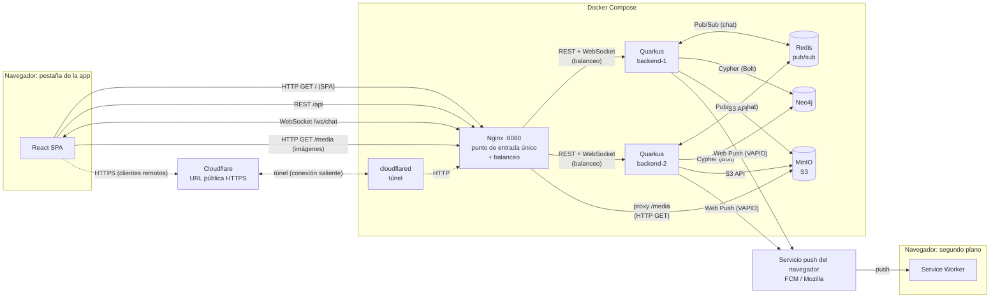

# Red Social Distribuida

Proyecto de la asignatura **Sistemas Distribuidos y Cloud Computing**.

Aplicación web distribuida que implementa las funcionalidades esenciales de una red social, integrando comunicación REST, WebSocket y Web Push, persistencia en una base de datos de grafos y almacenamiento de objetos compatible con S3.

## Integrantes

- Jose
- Luis
- Dayron

## Stack

| Componente | Tecnología |
|---|---|
| Frontend | React |
| Backend | Quarkus + Java |
| Base de datos de grafos | Neo4j |
| Almacenamiento de archivos | Object Storage compatible con S3 |
| Tiempo real | WebSocket |
| Notificaciones | Web Push |
| Despliegue | Docker Compose |

## Arquitectura

El navegador habla con un único punto de entrada (Nginx). Nginx sirve la SPA, reparte las peticiones entre dos instancias del backend y expone las imágenes de MinIO.
Las instancias persisten en Neo4j, guardan archivos en MinIO, se coordinan por Redis para el chat y envían notificaciones a través del servicio push del navegador.

- React SPA y Service Worker corren en el mismo navegador. Se dibujan separados porque el Service Worker sigue activo en segundo plano y recibe las notificaciones aunque la pestaña de la app esté cerrada.
- Las líneas punteadas muestran el camino de los clientes remotos: llevan el mismo tráfico (SPA, REST, WebSocket, imágenes) que un cliente local, pero entran por el túnel HTTPS.

### Qué viaja por cada canal

| Origen → Destino | Mecanismo | Qué transporta | Por qué este mecanismo |
|---|---|---|---|
| React → Quarkus (vía Nginx) | REST/HTTP | CRUD, feed, seguir, reacciones, historial del chat | Operaciones puntuales de pedido/respuesta, sin estado de conexión |
| React ↔ Quarkus (vía Nginx) | WebSocket | Mensajes de chat en tiempo real | Conexión persistente y bidireccional: el servidor envía sin que el cliente pregunte |
| Quarkus → Servicio push → Service Worker | Web Push | Aviso de nueva publicación | Llega aunque la app esté cerrada; el canal lo mantiene el navegador, no la aplicación |
| Quarkus → Neo4j | Bolt + Cypher | Usuarios, relaciones, posts, mensajes, suscripciones push | Los datos son relaciones: seguir, publicar, reaccionar |
| Quarkus → MinIO | S3 API | Archivos binarios (imágenes) | Los binarios no pertenecen a una base de datos |
| Navegador → MinIO (vía Nginx) | HTTP GET | Descarga de imágenes | El backend no tiene que retransmitir cada imagen |
| Quarkus ↔ Redis | Pub/Sub | Mensajes de chat entre instancias | Cada instancia solo conoce sus propias conexiones WebSocket; el broker las comunica |
| Cliente remoto → Cloudflare → `cloudflared` → Nginx | Túnel HTTPS | Todo el tráfico de la aplicación | Da un contexto seguro (HTTPS), requisito de Service Worker y Web Push, sin abrir puertos |
